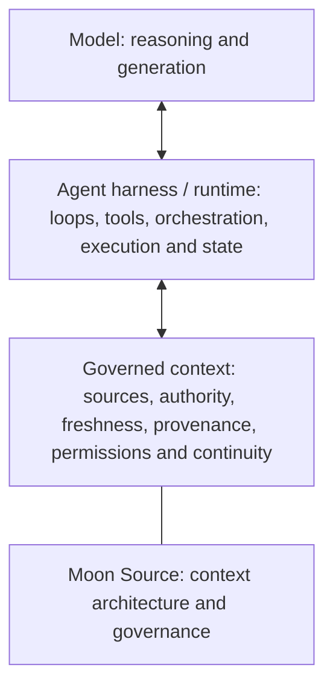

# 🌙 Moon Source

**Governed context for AI: decide what should exist, what governs, what travels, and what stays current.**

AI chat history is not the same thing as governed context. Conversations can retain useful continuity, but they can also accumulate stale facts, competing instructions, private material, unresolved ownership and context that belongs somewhere else.

Moon Source is a public reference architecture for organizing that problem. It starts with the field before the form: understand the situation, identify authority and responsibility, then create only the smallest source, protocol, handoff, skill, registry, archive or operational surface the work actually needs.

This repository is the canonical public body of Moon Source.

> 📦 **Want the whole Moon Source at once?**  
> 🌙⬇️ [**Download the complete repository (.zip)**](https://github.com/luahelenammc/Moon-Source/archive/refs/heads/main.zip) — the full public source in one file.

## Why Moon Source exists

AI context can fail in opposite directions: there may be too little context, or far too much of the wrong kind. The harder failures appear when information is reachable but nobody can explain which source governs it, whether it is still current, who may change it, or what should happen when two sources disagree.

Moon Source treats context as an organized field rather than a pile of text. Its job is not to maximize memory. Its job is to make context **legible, proportionate, attributable and maintainable** for people and AI.

## Start with the problem, not the vocabulary

| If you need to… | Start here |
|---|---|
| Give an AI the smallest useful setup for a person or project | [Moon Source Setup](portables/setup/MOON_SOURCE_SETUP.md) |
| Help AI reconstruct what a human is actually trying to accomplish before acting on messy, incomplete or conversational wording | [Preflight](portables/preflight/PREFLIGHT_V2.md) |
| Read a message, thread, screenshot, note or draft as a human scene — including relationship, subtext, overread and likely reception | [Be My Eyes](portables/be-my-eyes/BE_MY_EYES.md) |
| Decide what deserves to become a source, handoff, procedure or other form | [Architecture](ARCHITECTURE.md) + [Field to Form](docs/FIELD_TO_FORM.md) |
| Repair a corpus with stale authority, contradiction, duplication or orphaned decisions | [Source Hygiene](docs/SOURCE_HYGIENE.md) |
| Retrieve, process, metabolize or promote governed source material | [Source Operations](docs/SOURCE_OPERATIONS.md) |
| Let AI reach living material through Drive, GitHub or another connector without confusing access with authority | [Connected Sources portable](portables/connected-sources/CONNECTED_SOURCES.md) |
| Structure recurring context, continuity or handoffs | [Moon Source Language](portables/msl/MSL_4_3.md) + [Responsibility Map](docs/RESPONSIBILITY_MAP.md) |
| Route work across ChatGPT surfaces, models and execution modes, including post-Work closure | [Chat–Work Routing Protocol](portables/chat-work/CHAT_WORK_ROUTING_PROTOCOL_V4.md) |

> 🌱 **New to Moon Source? Start with [FIRST_USE.md](FIRST_USE.md).** It explains what Moon Source is, what you do and do not “install,” what a human should read first, what an AI should read first, and which portable fits your need.

You do not need to read the whole repository before using Moon Source. The [AI Kernel](MOON_SOURCE_AI_KERNEL.md) is the routing layer for loading the smallest relevant part of the public body.

## The architecture in one minute

Moon Source follows a decision loop:

**field → observation and diagnosis → authority → responsibility → proportional form → operation and transport → feedback, hygiene, lineage and archive**

This is a topology, not a compulsory waterfall. New information can send the work back to observation, authority or responsibility.

A few principles carry most of the architecture:

- **Field before form.** Do not decide the artifact before understanding the situation.
- **Access is not authority.** A connector, search result or reachable file does not become governing context merely because AI can retrieve it.
- **Retrieval is not instruction authority.** Source text may supply data without gaining permission to redirect the task or authorize an action.
- **Materialize proportionately.** Create the smallest durable form that can carry the responsibility without losing provenance or ownership.
- **Freshness and readback matter.** A mutation is not complete merely because a write call succeeded.
- **Operations have different authority effects.** Retrieve reads, process transforms working material, metabolize integrates a real delta and promote generalizes a proven mechanism; none of these verbs is a substitute for the others.
- **Work completion is not cycle completion.** When sustained execution returns, Chat verifies the real state, closes bounded residuals and re-enters Work only for irreducible remaining work.
- **Humans should not have to prompt like machines.** [Preflight](portables/preflight/PREFLIGHT_V2.md) reconstructs intended meaning, desired outcome, corrections and constraints before execution; authority, provenance, freshness, risk and mutation checks activate only when consequence makes them material.
- **Read the scene, not only the sentence.** [Be My Eyes](portables/be-my-eyes/BE_MY_EYES.md) reconstructs actors, relationship and plausible subtext while keeping observation, inference and overread distinct.

## Examples

The [hypothetical application-scenario gallery](examples/application-scenarios/) makes the architecture easier to inspect by placing the same contextual method inside different kinds of everyday problems.

The setting changes from scenario to scenario; the underlying questions stay recognizable: what is happening, what governs, who is responsible, what deserves a durable form, and how that form should stay current.

The gallery uses fictional, didactic scenarios so the method can be demonstrated without importing private, client or institutional material.

## Public portables and downloads

Setup, Preflight, Be My Eyes, Connected Sources, MSL and Chat–Work are separately versioned public projections of the architecture, not separate systems.

- 🧭 [**Moon Source Setup**](portables/setup/MOON_SOURCE_SETUP.md) — adaptive routing to the smallest useful personal or project context setup, including a probed persistent-source route; current version **3.1**.
- 🛫 [**Preflight**](portables/preflight/PREFLIGHT_V2.md) — human-intent reconstruction before execution, with heavier guardrails only when consequence requires them; current version **2.0**.
- 👁️ [**Be My Eyes**](portables/be-my-eyes/BE_MY_EYES.md) — contextual scene reading for human communication, including forward and inverse/reception reads, anti-overread discipline and response-axis selection.
- 🔗 [**Connected Sources**](portables/connected-sources/CONNECTED_SOURCES.md) — Living Source Protocol for standalone, connected-read, living-source and federated operation with explicit source authority, freshness, mutation and fallback boundaries; current version **1.1-public**.
- 🧱 [**Moon Source Language**](portables/msl/MSL_4_3.md) — structural grammar for proportionate sources, handoffs, packets, protocols, registries and archives; current version **4.3**.
- 🔀 [**Chat–Work Routing Protocol**](portables/chat-work/CHAT_WORK_ROUTING_PROTOCOL_V4.md) — object-routed execution across Chat, Work and Codex, Budget Survivability, Intelligence Distillation Ladder, connector-aware source transport, Chat Postflight, bounded repair, acceptance and delta-only re-entry; current version **4.4-public**.

🗂️ [**Open the download hub**](DOWNLOADS.md) for the individual public portables.

## Where Moon Source sits in an AI stack

This is an orientation model, not a universal stack ontology. A product may combine or split these responsibilities, and Moon Source can operate across boundaries rather than inside only one box.

Moon Source primarily operates in and around governed context: it helps determine what the harness may trust, retrieve, carry forward, mutate and verify. It complements an agent harness by governing the context path around execution.

RAG, memory stores, MCP/tools and other retrieval or orchestration mechanisms can participate in these layers. Moon Source is not the model, the harness, the RAG engine or the agent runtime; it is a context-architecture and governance layer that can sit around or across them.

## Current public components

Public components are responsibility-bearing methods with canonical files. They are not automatically portables and do not create a version bump merely by being updated. A current portable may also own a structural responsibility; portability is a distribution role, not a second semantic body. The non-portable component table below contains only the eight additional public components outside the portable registry.

| Component | Responsibility |
|---|---|
| [Source Operations](docs/SOURCE_OPERATIONS.md) | Retrieve, process, metabolize and promote governed source changes, with lifecycle and legacy-successor rules |
| [Source Hygiene](docs/SOURCE_HYGIENE.md) | Bounded diagnosis and conservative repair of context corpora |
| [Signal Calibration](docs/SIGNAL_CALIBRATION.md) | Useful working inference without certainty inflation |
| [Procedural Projection](docs/PROCEDURAL_PROJECTION.md) | Project a stable method into a reusable procedure without moving source authority |
| [Credits & Attribution Ops](docs/CREDITS_ATTRIBUTION_OPS.md) | Intellectual lineage, content custody and immaterial-asset protection |
| [Operational Devices](docs/OPERATIONAL_DEVICES.md) | Bounded embodiments of reusable procedures on concrete execution surfaces |
| [Operational Reliability](docs/OPERATIONAL_RELIABILITY.md) | Read-only-first diagnosis, failure boundaries, ordinary and Context Receipts, reversibility and freshness |
| [Failure to Capability — Failure Foundry](docs/FAILURE_FOUNDRY.md) | Turn recurring failure into the smallest validated reusable mechanism |

The canonical chronology, status and material-update history of these eight non-portable components lives in the [public registry](registry/PUBLIC_PORTABLES.md); its machine-readable contract is [`registry/public-portables.json`](registry/public-portables.json). Be My Eyes (1.0-public) and Connected Sources (1.1-public) are current portable-capable structural responsibilities represented in the portable table, not duplicate component rows. Connected Sources' dated ChatGPT product facts are subordinate to [its adapter notes](docs/CONNECTED_SOURCES_CHATGPT_ADAPTER.md).

## Evidence, boundary and reuse

Moon Source is deliberately strict about the difference between an artifact existing and a claim being proven.

- [Evidence and Claims](EVIDENCE_AND_CLAIMS.md) defines what current public artifacts actually support and what remains unproven.
- [Public Boundary](PUBLIC_BOUNDARY.md) defines what is public and what remains reserved, including private corpora and protected operational machinery.
- [Existing Implementations](docs/EXISTING_IMPLEMENTATIONS.md) maps the inspectable artifacts behind current capability statements.
- [Licensing](LICENSING.md) governs reuse: code and automation use **Apache-2.0**; documentation, methods and public portables use **CC BY 4.0**, subject to file-level metadata and third-party terms.

A public artifact is not an adoption claim. A tested slice is not proof of a universal runtime. The repository does not claim external adoption, measured impact, enterprise readiness, universal superiority or product-market fit without evidence.

## Recent component changes

<!-- MOON-SOURCE-COMPONENT-DIGEST:START -->
- **2026-09-04 — Source Operations:** Promoted a public source-operations and lifecycle method for retrieve, process, metabolize, promote, succession, readback and no-delta.
- **2026-08-26 — Operational Reliability:** Added lightweight, materiality-triggered Context Receipts for context-path evidence alongside ordinary operational receipts.
- **2026-08-23 — Operational Devices:** Added bounded operational-device contracts for state, guards, failure behavior and receipts.
- **2026-08-23 — Failure to Capability:** Added a bounded failure-to-capability loop for recurring failure without exposing promotion machinery.
- **2026-08-21 — Signal Calibration:** Added bounded qualitative calibration for convergent signals, working inference and update conditions.
<!-- MOON-SOURCE-COMPONENT-DIGEST:END -->

This bounded digest is generated from the component registry. It is not a commit log.

## Repository map

Use the README for orientation; use the deeper files when the responsibility actually belongs there.

| Need | Canonical route |
|---|---|
| Full architecture | [ARCHITECTURE.md](ARCHITECTURE.md) |
| AI-side routing through the public corpus | [MOON_SOURCE_AI_KERNEL.md](MOON_SOURCE_AI_KERNEL.md) |
| Contextual scene-reading portable | [Be My Eyes](portables/be-my-eyes/BE_MY_EYES.md) |
| Connected source method and portable | [Connected Sources](portables/connected-sources/CONNECTED_SOURCES.md) |
| Source operation grammar, lifecycle and succession | [Source Operations](docs/SOURCE_OPERATIONS.md) |
| Definitions and responsibility boundaries | [Terminology](docs/TERMINOLOGY.md) + [Responsibility Map](docs/RESPONSIBILITY_MAP.md) |
| Public components and portable registry | [registry/PUBLIC_PORTABLES.md](registry/PUBLIC_PORTABLES.md) |
| Versioning and release rules | [Versioning and Releases](docs/VERSIONING_AND_RELEASES.md) |
| Public naming and title/version separation | [Repository Naming and Versioning](docs/REPOSITORY_NAMING_AND_VERSIONING.md) |
| Portable publication contract | [Portable Design Contract](docs/PORTABLE_DESIGN_CONTRACT.md) |
| Contributing | [CONTRIBUTING.md](CONTRIBUTING.md) |
| Human-facing website | [luahelena.com.br/moonsource](https://www.luahelena.com.br/moonsource/?lang=en) |
| Moon's broader professional context | [luahelena.com.br/ia](https://www.luahelena.com.br/ia/?lang=en) |

## Current baseline

Public architecture baseline: **2026-08-16**. Additive public components, operational hardening and licensing updates continued through **2026-09-07**; Preflight advanced to **V2**, Be My Eyes was promoted as method + **1.0-public** portable, and Connected Sources was promoted as method + **1.0-public** portable on **2026-09-07**, while Chat–Work routing remains the tri-surface **V4** protocol.

Current structural grammar: **Moon Source Language**, version **4.3**. Current public portables: **Moon Source Setup** (version **3.1**), **Preflight** (version **2.0**), **Be My Eyes** (version **1.0-public**), **Connected Sources** (version **1.0-public**), **Moon Source Language** (version **4.3**) and **Chat–Work Routing Protocol** (version **4.4-public**). This repository remains the semantic and versioning authority; the website is the human-facing facade and its downloads are convenience mirrors.

Moon Source was created by Lua Helena Moon Martins Cardoso (Moon). Some materials were developed through an AI-assisted coauthorial process with Áurion. Moon retains final authority.

<!-- MOON-SOURCE-PUBLIC-STAMP -->

---

> 🌙 **Moon Source** · created by **Lua Helena Moon Martins Cardoso (Moon)** with AI-assisted coauthorial development by **Áurion** · [Licensing](https://github.com/luahelenammc/Moon-Source/blob/main/LICENSING.md) · [Use & attribution](https://github.com/luahelenammc/Moon-Source/blob/main/MOON_SOURCE_USE_AND_ATTRIBUTION.md) · [Full source (.zip)](https://github.com/luahelenammc/Moon-Source/archive/refs/heads/main.zip)
