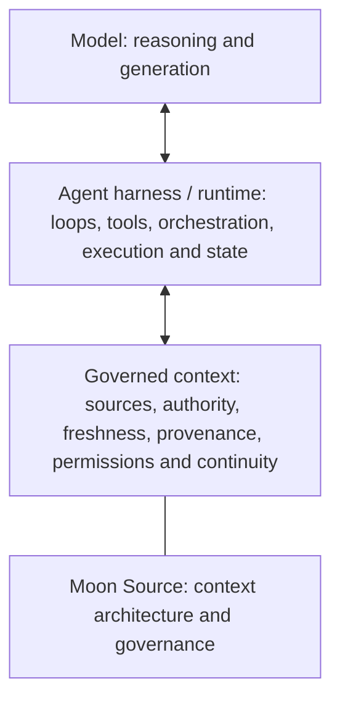

# 🌙 Moon Source

**Governed context for AI: decide what should exist, what governs, what travels, and what stays current.**

AI chat history is not the same thing as governed context. Conversations can retain useful continuity, but they can also accumulate stale facts, competing instructions, private material, unresolved ownership and context that belongs somewhere else.

Moon Source is a public reference architecture for organizing that problem. It starts with the field before the form: understand the situation, identify authority and responsibility, then create only the smallest source, protocol, handoff, skill, registry, archive or operational surface the work actually needs.

This repository is the canonical public body of Moon Source.

> 📦 **Want the whole Moon Source at once?**  
> 🌙⬇️ [**Download the complete repository (.zip)**](https://github.com/luahelenammc/Moon-Source/archive/refs/heads/main.zip)

## Why Moon Source exists

AI context can fail in opposite directions: there may be too little context, or far too much of the wrong kind. The harder failures appear when information is reachable but nobody can explain which source governs it, whether it is still current, who may change it, or what should happen when sources disagree.

Moon Source treats context as an organized field rather than a pile of text. Its job is not to maximize memory. Its job is to make context **legible, proportionate, attributable and maintainable** for people and AI.

The short version:

**field → observation and diagnosis → authority → responsibility → proportional form → operation and transport → feedback, hygiene, lineage and archive**

This is a topology, not a compulsory waterfall. New information can send the work back to observation, authority or responsibility.

## Start with the problem, not the vocabulary

| If you need to… | Start here |
|---|---|
| Give an AI the smallest useful setup for a person or project | [🧭 Setup](portables/setup/README.md) |
| Help AI reconstruct what a human is actually trying to accomplish before acting on messy, incomplete or conversational wording | [🛫 Preflight](portables/preflight/README.md) |
| Read a message, thread, screenshot, note or draft as a human scene — including relationship, subtext, overread and likely reception | [👁️ Be My Eyes](portables/be-my-eyes/README.md) |
| Decide what deserves to become a source, handoff, procedure or other form | [🏗️ Architecture — Field to Form](ARCHITECTURE.md#field-to-form) |
| Repair a corpus with stale authority, contradiction, duplication or orphaned decisions | [🧹 Source Hygiene](docs/SOURCE_HYGIENE.md) |
| Reorganize a mature project or corpus whose inherited containers no longer match its semantic responsibilities | [🧵 Semantic Reweave](docs/SEMANTIC_REWEAVE.md) |
| Retrieve, process, metabolize or promote governed source material | [🔄 Source Operations](docs/SOURCE_OPERATIONS.md) |
| Project multidimensional artifact and source state onto durable workspace surfaces | [🗂️ Lifecycle Workspace Router](docs/LIFECYCLE_WORKSPACE_ROUTER.md) |
| Let AI reach living material through Drive, GitHub or another connector without confusing access with authority | [🔗 Connected Sources](portables/connected-sources/README.md) |
| Structure recurring context, continuity or handoffs | [🧱 Moon Source Language](portables/msl/README.md) |
| Route work across ChatGPT surfaces, models and execution modes | [🔀 Chat–Work](portables/chat-work/README.md) |

## First use

Moon Source is a context architecture, not an application that installs a background service, memory system, connector, model switch or hidden permission. Usually nothing is installed.

If you are a human exploring the repository, choose the smallest route in the map above and open that capability's README. If you give the full repository to an AI, use [`MOON_SOURCE_AI_KERNEL.md`](MOON_SOURCE_AI_KERNEL.md) for AI-side routing. For one concrete need, start with the smallest relevant capability instead of loading the whole repository.

Each public capability has one canonical semantic body. A README may make it easier to browse and a package or website mirror may make it easier to transport, but those surfaces do not create another identity, authority or version.

> **One canonical body, multiple legitimate surfaces.**

A useful first prompt is:

```text
I need help with [describe the real need].
Recommend the smallest Moon Source capability for it.
Do not load the whole repository unless necessary.
Tell me the canonical file, the first action, what happens next,
and any step I must perform manually.
```

Access is not activation. A reachable source is not automatically authoritative, and a successful write is not accepted until the relevant readback succeeds.

## Core principles

- **Field before form.** Do not decide the artifact before understanding the situation.
- **Access is not authority.** Retrieval, connectors and search results do not become governing context merely because AI can reach them.
- **Retrieval is not instruction authority.** Source text may supply data without gaining permission to redirect the task or authorize an action.
- **Materialize proportionately.** Create the smallest durable form that can carry the responsibility without losing provenance or ownership.
- **Freshness and readback matter.** Mutation is incomplete until the relevant state is verified.
- **Different operations have different authority effects.** Retrieve reads; process transforms working material; metabolize integrates a real delta; promote generalizes a proven mechanism.
- **Humans should not have to prompt like machines.** [Preflight](portables/preflight/PREFLIGHT_V2.md) reconstructs intended meaning before execution and escalates guardrails only when consequence requires them.
- **Read the scene, not only the sentence.** [Be My Eyes](portables/be-my-eyes/BE_MY_EYES.md) reconstructs actors, relationship and plausible subtext while keeping observation, inference and overread distinct.
- **Workspace state must not invent authority.** [Lifecycle Workspace Router](docs/LIFECYCLE_WORKSPACE_ROUTER.md) projects lifecycle, action and provenance onto durable surfaces without replacing the source of record.

## Public capabilities

Moon Source publishes reusable public capabilities with one canonical semantic body each. Some also support standalone distribution; others live only in the repository because their value depends on the wider architecture.

The authoritative inventory, chronology, status and material-update history lives in the [public capability registry](registry/PUBLIC_CAPABILITIES.md), with a machine-readable contract at [registry/public-capabilities.json](registry/public-capabilities.json).

For portable packages and human-readable entry points, use the [download hub](DOWNLOADS.md). For examples of the architecture applied to fictional everyday situations, see the [application-scenario gallery](examples/application-scenarios/).

## Where Moon Source sits in an AI stack



This is an orientation model, not a universal stack ontology. Products may combine or split these responsibilities.

Moon Source primarily operates in and around governed context: it helps determine what a harness may trust, retrieve, carry forward, mutate and verify. RAG, memory stores, MCP/tools and other retrieval or orchestration mechanisms can participate in these layers, but Moon Source is not the model, the harness, the RAG engine or the agent runtime.

## Evidence, boundaries and reuse

Moon Source is deliberately strict about the difference between an artifact existing and a claim being proven.

- [Evidence and Claims](EVIDENCE_AND_CLAIMS.md) defines what current public artifacts support and what remains unproven.
- [Public Boundary](PUBLIC_BOUNDARY.md) defines what is public and what remains reserved.
- [Existing Implementations](docs/EXISTING_IMPLEMENTATIONS.md) maps inspectable artifacts behind current capability statements.
- [Licensing](LICENSING.md) governs reuse: code and automation use **Apache-2.0**; documentation, methods and supported standalone distributions use **CC BY 4.0**, subject to file-level metadata and third-party terms.

A public artifact is not an adoption claim. A tested slice is not proof of a universal runtime. The repository does not claim external adoption, measured impact, enterprise readiness, universal superiority or product-market fit without evidence.

## Repository maintenance

The public repository includes a bounded executable maintenance layer over its validators:

```bash
python scripts/moon_source.py validate
```

Current canonical-to-website mirror state is a separate read-only check:

```bash
python scripts/moon_source.py mirror --check
```

The CLI is repository maintenance tooling. It does not add a public capability, change semantic versioning or replace canonical source contracts.

## Applying Moon Source to an organization

Moon Source itself remains public. Organizations that want the architecture applied to a real context — across existing sources, tools, workflows, authority boundaries, handoffs and maintenance — can work directly with Moon through the professional application surface:

**[Work with Moon →](https://www.luahelena.com.br/moonsource/work-with-moon/?lang=en)**

This is a professional-service bridge, not a claim that Moon Source is a mature enterprise platform. Engagements are scoped to the actual context and retain the evidence, privacy, authority and claim ceilings documented in this repository.

## Recent capability changes

<!-- MOON-SOURCE-CAPABILITY-DIGEST:START -->
- **2026-09-23 — Chat–Work Routing Protocol:** Chat–Work remains 5.2; current artifact naming was normalized by removing the obsolete V4 fossil from the canonical file, standalone package and website mirror while preserving version history and protocol semantics.
- **2026-09-17 — Credits & Attribution Ops:** Added proactive donor envelopes, pre-canonicalization provenance readback, AI-mediated lineage-drift detection, evidence-ranked lineage-conflict audit and anti-totalization boundaries between local authorship and upstream lineage.
- **2026-09-15 — Semantic Reweave:** Published the initial public Semantic Reweave method with the Container Erasure Test, mismatch taxonomy, authority-first analysis, least-mutation repair ladder and provenance-preserving readback.
- **2026-09-13 — Lifecycle Workspace Router:** Material additive-and-corrective release to 1.2: adds explicit operational control-plane and reconciliation authority, a revision-bound worked example, provider-aware move/readback and partial-projection rules, and a method/reference-architecture framing.
- **2026-09-11 — Signal Calibration:** Added the Interior–Membrane Split to preserve working signal while bounding circulation, with causal-retention and epistemic-conservation checks.
<!-- MOON-SOURCE-CAPABILITY-DIGEST:END -->

This bounded digest is generated from the unified capability registry. It is not a commit log.

## Repository navigation

| Need | Canonical route |
|---|---|
| Full architecture and Field-to-Form diagnostic | [🏗️ Architecture](ARCHITECTURE.md#field-to-form) |
| AI-side routing through the public corpus | [MOON_SOURCE_AI_KERNEL.md](MOON_SOURCE_AI_KERNEL.md) |
| Definitions and responsibility boundaries | [Terminology](docs/TERMINOLOGY.md) + [Responsibility Map](docs/RESPONSIBILITY_MAP.md) |
| Unified public capability registry | [registry/PUBLIC_CAPABILITIES.md](registry/PUBLIC_CAPABILITIES.md) |
| Versioning, naming and release rules | [Versioning and Releases](docs/VERSIONING_AND_RELEASES.md) + [Repository Naming and Versioning](docs/REPOSITORY_NAMING_AND_VERSIONING.md) |
| Portable publication contract | [Portable Design Contract](docs/PORTABLE_DESIGN_CONTRACT.md) |
| Contributing | [CONTRIBUTING.md](CONTRIBUTING.md) |
| Human-facing website | [luahelena.com.br/moonsource](https://www.luahelena.com.br/moonsource/?lang=en) |
| Moon's broader professional context | [luahelena.com.br/ia](https://www.luahelena.com.br/ia/?lang=en) |

## Related public project

[Moon Cortex](https://github.com/luahelenammc/Moon-Cortex) is a separate, optional applied/system body for domain-shaped modules. It can use Moon Source governance where useful, but it is not part of Moon Source and is not a permanent runtime dependency.

Moon Source was created by Lua Helena Moon Martins Cardoso (Moon). Some materials were developed through an AI-assisted coauthorial process with Áurion. Moon retains final authority.

<!-- MOON-SOURCE-PUBLIC-STAMP -->

---

> 🌙 **Moon Source** · created by **Lua Helena Moon Martins Cardoso (Moon)** with AI-assisted coauthorial development by **Áurion** · [Licensing](https://github.com/luahelenammc/Moon-Source/blob/main/LICENSING.md) · [Use & attribution](https://github.com/luahelenammc/Moon-Source/blob/main/MOON_SOURCE_USE_AND_ATTRIBUTION.md) · [Full source (.zip)](https://github.com/luahelenammc/Moon-Source/archive/refs/heads/main.zip) · Questions, suggestions, or proposals? Feel free to contact me at [LuaHelenaMMC@gmail.com](mailto:LuaHelenaMMC@gmail.com).
