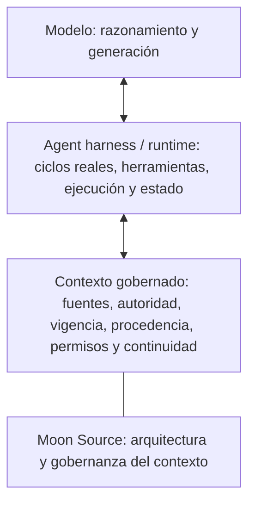

# 🌙 Moon Source

<!--
MOON-SOURCE-README-TRANSLATION
locale: es
source: ../README.md
source_sha256: 4d7152376f0f4dd8f1d8d22c6c2e1762bdd6435e3d526b8ff7e315da26d087a4
contract: ../docs/README_TRANSLATIONS.md
-->

<!-- MOON-SOURCE-LANGUAGE-NAV:START -->
🌐 **Lee este README en:** [🇬🇧 English](../README.md) · [🇧🇷 Português (Brasil)](README.pt-BR.md) · [🇪🇸 Español](README.es.md) · [🇨🇳 简体中文](README.zh-CN.md) · [🇷🇺 Русский](README.ru.md)
<!-- MOON-SOURCE-LANGUAGE-NAV:END -->

Esta es una traducción completa del README canónico en inglés. Es un espejo derivado para facilitar el acceso; si hay alguna diferencia, prevalece el README en inglés hasta que se corrija esta traducción.

**Contexto gobernado para IA: decide qué debe existir, qué tiene autoridad, qué circula y qué se mantiene al día.**

Moon Source es una arquitectura pública de referencia para decidir qué contexto debe usar la IA, qué fuente tiene autoridad, qué puede cambiar y cómo mantener legible el contexto útil a lo largo del tiempo. Este repositorio es su cuerpo público canónico.

## ¿Qué te trae aquí?

| Si quieres… | Empieza aquí |
|---|---|
| Ayudar a la IA a entenderte a ti o a uno de tus proyectos con más coherencia | [Empieza aquí](../START_HERE.md), escrito en lenguaje cotidiano para quienes llegan por primera vez |
| Crear sistemas de IA y ver cómo encaja el contexto gobernado en tu stack actual | [Para quienes construyen con IA](../docs/FOR_AI_BUILDERS.md) |
| Examinar la arquitectura completa y el contrato de enrutamiento del lado de la IA | [Architecture](../ARCHITECTURE.md) · [Moon Source AI Kernel](../MOON_SOURCE_AI_KERNEL.md) |

## Prueba Moon Source en 60 segundos

Copia esto en una conversación con una IA y describe el problema con tus propias palabras:

~~~text
Siempre tengo este problema con la IA:
[descríbelo con normalidad]

Usa Moon Source para identificar la estructura de contexto más pequeña
que realmente ayudaría. No me hagas aprender primero el vocabulario de Moon Source.

Dime:
1. qué problema importa aquí;
2. cuál es la estructura útil más pequeña;
3. dónde debería vivir;
4. cómo debería actualizarse;
5. qué debería probar primero.
~~~

Un buen primer resultado debe conectar **problema → estructura útil mínima → destino → regla de actualización → primera prueba**.

> ¿Quieres toda la referencia pública de una vez? [Descarga el repositorio completo (.zip)](https://github.com/luahelenammc/Moon-Source/archive/refs/heads/main.zip).

## Por qué existe Moon Source

El contexto de IA puede fallar en sentidos opuestos: puede haber demasiado poco contexto o demasiado del tipo equivocado. Los fallos más difíciles aparecen cuando la información está disponible, pero nadie puede explicar qué fuente tiene autoridad, si sigue vigente, quién puede cambiarla o qué hacer cuando las fuentes no coinciden.

Moon Source trata el contexto como un campo organizado, no como un montón de texto. Su función no es maximizar la memoria. Es hacer que el contexto sea **legible, proporcional, atribuible y mantenible** para las personas y la IA.

En pocas palabras:

**campo → observación y diagnóstico → autoridad → responsabilidad → forma proporcional → operación y transporte → retorno, higiene, linaje y archivo**

Es una topología, no una secuencia obligatoria. La información nueva puede hacer que el trabajo vuelva a la observación, la autoridad o la responsabilidad.

Las decisiones de ejecución también necesitan una gobernanza proporcional. El [Adaptive Orchestration Protocol (AOP)](../portables/adaptive-orchestration/README.md) parte de una regla práctica: **usa cada modelo, superficie y unidad de razonamiento donde realmente resulte útil**. Separa la raíz de control, la superficie de ejecución, la capacidad del modelo, el esfuerzo de razonamiento y la delegación, en lugar de reducirlos a una sola elección de prestigio. Su objetivo es el **mínimo de trabajo total para llegar a un estado aceptado**: la ejecución suficiente de menor costo absorbe el volumen reducible, la cognición más potente se concentra en los cuellos de botella reales, y la ingestión repetida de contexto, los reintentos, el cambio de herramientas, la delegación innecesaria y el cambio de superficie se consideran costes que hay que reducir, no carga invisible. El beneficio práctico es menos gasto evitable de tokens/contexto y menos razonamiento de nivel alto desperdiciado, sin fingir que una única llamada más barata sea siempre la ruta más barata.

## Empieza por el problema, no por el vocabulario

La división de abajo es arquitectónica, no solo una clasificación de descargas. Los **Portables** son capacidades cuya propia identidad semántica es portátil. La **distribución independiente** es una propiedad de entrega distinta: un componente estructural también puede distribuirse por separado sin convertirse en un Portable. Connected Sources es el ejemplo importante que aparece abajo.

### Puntos de entrada portables

| Si necesitas… | Empieza aquí |
|---|---|
| Usar la capacidad de IA con eficiencia entre raíces, superficies, modelos, esfuerzo de razonamiento y delegación, minimizando el trabajo total hasta un resultado aceptado | [🧬 Adaptive Orchestration Protocol](../portables/adaptive-orchestration/README.md) |
| Llevar contexto entre fuentes y superficies sin perder significado, procedencia ni autoridad | [🧱 Moon Source Language](../portables/msl/README.md) |
| Crear el contexto útil mínimo para una persona o proyecto | [🧭 Setup](../portables/setup/README.md) |
| Reconstruir la tarea humana antes de ejecutarla cuando la expresión es confusa, incompleta o se corrige sobre la marcha | [🛫 Preflight](../portables/preflight/README.md) |
| Leer comunicaciones y artefactos como escenas humanas y distinguir observación de inferencia | [👁️ Be My Eyes](../portables/be-my-eyes/README.md) |

### Arquitectura y componentes estructurales

| Si necesitas… | Empieza aquí |
|---|---|
| Decidir qué necesita un campo antes de elegir su forma duradera | [🏗️ Architecture — Field to Form](../ARCHITECTURE.md#field-to-form) |
| Acceder a fuentes vivas y mantener bajo gobierno el acceso, la autoridad, la vigencia, la modificación y la lectura de comprobación | [🔗 Connected Sources](../docs/CONNECTED_SOURCES.md#first-use) |
| Recuperar, procesar, metabolizar o promover material de fuentes gobernadas | [🔄 Source Operations](../docs/SOURCE_OPERATIONS.md) |
| Diagnosticar autoridad obsoleta, problemas de vigencia, duplicación o contradicción y encontrar la reparación mínima y segura del corpus | [🧹 Source Hygiene](../docs/SOURCE_HYGIENE.md) |
| Recuperar la topología semántica de un corpus y reparar su organización heredada sin reconstruirlo desde cero | [🧵 Semantic Reweave](../docs/SEMANTIC_REWEAVE.md) |
| Proyectar el ciclo de vida, la acción y la procedencia en superficies duraderas del espacio de trabajo | [🗂️ Lifecycle Workspace Router](../docs/LIFECYCLE_WORKSPACE_ROUTER.md) |
| Preservar autoría, permisos, linaje y evidencia a medida que el material se mueve o cambia | [🧾 Credits & Attribution Ops](../docs/CREDITS_ATTRIBUTION_OPS.md) |
| Convertir un método estable en un procedimiento reutilizable y acotado | [🧩 Procedural Projection](../docs/PROCEDURAL_PROJECTION.md) |
| Mantener la ejecución acotada, diagnosticable y recuperable cuando sea posible | [🛡️ Operational Reliability](../docs/OPERATIONAL_RELIABILITY.md) |
| Materializar un procedimiento recurrente en una superficie de ejecución concreta con estado, protecciones y comprobantes | [🛠️ Operational Devices](../docs/OPERATIONAL_DEVICES.md) |
| Usar evidencia ambigua o convergente sin exagerar la certeza | [🎚️ Signal Calibration](../docs/SIGNAL_CALIBRATION.md) |
| Convertir un fallo recurrente en el mecanismo reutilizable más pequeño que haya sido validado | [🏭 Failure to Capability — Failure Foundry](../docs/FAILURE_FOUNDRY.md) |

## Primer uso

Moon Source es una arquitectura de contexto, no una aplicación que instale un servicio en segundo plano, un sistema de memoria, un conector, un cambio de modelo o un permiso oculto. Normalmente no se instala nada.

Si exploras el repositorio como persona, elige la ruta más pequeña del mapa de arriba y abre el README de esa capacidad. Si entregas el repositorio completo a una IA, usa `MOON_SOURCE_AI_KERNEL.md` para el enrutamiento del lado de la IA. Para una necesidad concreta, empieza por la capacidad pertinente más pequeña en lugar de cargar todo el repositorio.

Cada capacidad pública tiene un único cuerpo semántico canónico. Un README puede facilitar la navegación y un paquete o espejo web puede facilitar el transporte, pero esas superficies no crean otra identidad, autoridad ni versión.

> **Un cuerpo canónico, varias superficies legítimas.**

Para una primera prueba en lenguaje sencillo, usa el breve prompt que aparece cerca del inicio de este README o sigue [Empieza aquí](../START_HERE.md).

Acceso no significa activación. Una fuente accesible no es automáticamente autoritativa, y una escritura correcta no se acepta hasta que la lectura de comprobación pertinente tenga éxito.

## Principios básicos

- **Campo antes que forma.** No decidas el artefacto antes de entender la situación.
- **Acceso no es autoridad.** La recuperación, los conectores y los resultados de búsqueda no se convierten en contexto rector solo porque la IA pueda acceder a ellos.
- **La recuperación no concede autoridad de instrucción.** El texto de una fuente puede aportar datos sin obtener permiso para redirigir la tarea o autorizar una acción.
- **Materializa de forma proporcional.** Crea la forma duradera más pequeña que pueda asumir la responsabilidad sin perder procedencia ni titularidad.
- **La vigencia y la lectura de comprobación importan.** Una modificación no está completa hasta que se verifica el estado pertinente.
- **Las distintas operaciones tienen efectos distintos sobre la autoridad.** Recuperar lee; procesar transforma el material de trabajo; metabolizar integra un cambio real; promover generaliza un mecanismo demostrado.
- **Las personas no deberían tener que escribir prompts como máquinas.** [Preflight](../portables/preflight/PREFLIGHT.md) reconstruye el sentido previsto antes de ejecutar y refuerza las protecciones solo cuando las consecuencias lo requieren.
- **Lee la escena, no solo la frase.** [Be My Eyes](../portables/be-my-eyes/BE_MY_EYES.md) reconstruye actores, relaciones y subtexto plausible, manteniendo separadas la observación, la inferencia y la sobreinterpretación.
- **El estado del espacio de trabajo no debe inventar autoridad.** [Lifecycle Workspace Router](../docs/LIFECYCLE_WORKSPACE_ROUTER.md) proyecta ciclo de vida, acción y procedencia en superficies duraderas sin sustituir la fuente de registro.
- **Optimiza el trabajo total hasta un estado aceptado.** [Adaptive Orchestration](../portables/adaptive-orchestration/README.md) usa la ejecución suficiente de menor costo para el volumen reducible, concentra la cognición más potente en los cuellos de botella reales y trata el cambio de contexto, los reintentos y la delegación innecesaria como costes, no como infraestructura gratuita.

## Capacidades públicas

Moon Source publica capacidades reutilizables, cada una con un cuerpo semántico canónico. Algunas también admiten distribución independiente; otras solo existen en el repositorio porque su valor depende de la arquitectura más amplia.

El inventario oficial, la cronología, el estado y el historial de cambios materiales se encuentran en el [registro público de capacidades](../registry/PUBLIC_CAPABILITIES.md), con un contrato legible por máquina en [registry/public-capabilities.json](../registry/public-capabilities.json).

Para consultar paquetes independientes y puntos de entrada para personas, usa el [centro de descargas](../DOWNLOADS.md). Connected Sources sigue siendo un componente estructural aunque Moon Source también lo publique como una distribución independiente compatible. Para ver ejemplos de la arquitectura aplicada a situaciones cotidianas ficticias, consulta la [galería de escenarios de aplicación](../examples/application-scenarios/).

## Dónde encaja Moon Source en un stack de IA



Este es un modelo de orientación, no una ontología universal de stacks. Los productos pueden combinar o separar estas responsabilidades.

Moon Source opera principalmente alrededor del contexto gobernado: ayuda a determinar en qué puede confiar un harness, qué puede recuperar, mantener, modificar y verificar. El [Adaptive Orchestration Protocol (AOP)](../portables/adaptive-orchestration/README.md) gobierna las decisiones entre las raíces de control, superficies de ejecución, modelos, esfuerzo de razonamiento y trabajadores delegados disponibles; el harness/runtime sigue realizando los ciclos, el uso de herramientas y la ejecución. RAG, almacenes de memoria, MCP/herramientas y otros mecanismos de recuperación u orquestación pueden participar en estas capas, pero Moon Source no es el modelo, el harness, el motor RAG ni el runtime del agente.

## Verlo en la práctica

Estos ejemplos facilitan la inspección del material público. Los ejemplos sintéticos y ficticios muestran una ilustración acotada, no un relato de adopción ni de resultados medidos.

- [Recorrido de primer uso del contexto de proyecto](../examples/first-use-project-context.md): un conjunto ficticio de fuentes, un conflicto, una interpretación acotada y una comprobación repetible.
- [Primer uso de Setup](../portables/setup/MOON_SOURCE_SETUP.md#first-use): un prompt independiente para decidir qué contexto ayudaría de verdad.
- [Pequeño ejemplo de Connected Sources](../docs/CONNECTED_SOURCES.md#tiny-example): un recorrido sobre autoridad y vigencia de fuentes. No implica que exista un conector en todos los entornos.
- [Browser Console Device](../examples/browser-console-device/README.md): una demostración sintética, experimental y de solo lectura que puede ejecutarse localmente.
- [Escenarios de aplicación hipotéticos](../examples/application-scenarios/): casos ficticios de proyectos, equipos y servicios.

### Cinco problemas pequeños de contexto

Las miniaturas de abajo son hipotéticas. Muestran el formato de una intervención útil, no resultados garantizados.

- **Continuidad del proyecto.** Antes: varios chats contienen detalles distintos del proyecto. Lectura: identificar qué fuente es responsable del objetivo y las decisiones actuales. Cambio mínimo: mantener una fuente breve del proyecto con una persona responsable y un desencadenante de actualización. Después: si se proporciona o está accesible, esa fuente puede orientar un nuevo chat en lugar de tratar todos los mensajes antiguos como actuales.
- **Contexto personal para la IA.** Antes: se repiten las mismas preferencias en tareas no relacionadas. Lectura: separar las preferencias estables y útiles de los detalles puntuales. Cambio mínimo: usar Setup para elegir un contexto personal pequeño y decidir dónde guardarlo. Después: solo el contexto pertinente acompaña las tareas recurrentes.
- **Proceso de equipo.** Antes: un procedimiento existe en un documento, una hoja de cálculo y un chat, sin una persona responsable actual clara. Lectura: asignar autoridad según la responsabilidad y la vigencia. Cambio mínimo: nombrar el procedimiento rector, quién responde por las excepciones y qué evento activa una actualización. Después: si la fuente y su estado están disponibles, una IA puede identificar la instrucción rectora.
- **Fuentes en conflicto.** Antes: dos archivos dan respuestas distintas. Lectura: identificar qué fuente rige ese dato, su fecha y si una afirmación más reciente es solo una propuesta. Cambio mínimo: resolver la cuestión de autoridad antes de combinar los textos. Después: la respuesta puede indicar qué rige y qué sigue siendo incierto.
- **Material externo actual.** Antes: la IA puede estar usando un fragmento en caché o una copia antigua. Lectura: comprobar el localizador de la fuente, el alcance de recuperación y la vigencia observada. Cambio mínimo: usar Connected Sources solo cuando el entorno exponga la fuente y la tarea lo justifique. Después: la respuesta puede decir qué leyó realmente y qué no pudo verificar.

## Evidencia, límites y reutilización

Moon Source distingue deliberadamente entre que exista un artefacto y que una afirmación esté demostrada.

- [Evidence and Claims](../EVIDENCE_AND_CLAIMS.md) define qué respaldan los artefactos públicos actuales y qué aún no está demostrado.
- [Public Boundary](../PUBLIC_BOUNDARY.md) define qué es público y qué se mantiene reservado.
- [Implementaciones existentes](../docs/EXISTING_IMPLEMENTATIONS.md) identifica los artefactos inspeccionables que respaldan las afirmaciones actuales sobre capacidades.
- [Licencias](../LICENSING.md) rige la reutilización: el código y la automatización usan **Apache-2.0**; la documentación, los métodos y las distribuciones independientes compatibles usan **CC BY 4.0**, sujeto a los metadatos de cada archivo y a las condiciones de terceros.

Un artefacto público no es una afirmación de adopción. Una parte probada no demuestra un runtime universal. El repositorio no afirma adopción externa, impacto medido, preparación empresarial, superioridad universal ni encaje producto-mercado sin evidencia.

## Mantenimiento del repositorio

El repositorio público incluye una capa de mantenimiento ejecutable y acotada sobre sus validadores:

```bash
python scripts/moon_source.py validate
```

El estado actual de la sincronización entre el contenido canónico y los espejos web tiene una comprobación separada y de solo lectura:

```bash
python scripts/moon_source.py mirror --check
```

La CLI es una herramienta de mantenimiento del repositorio. No añade una capacidad pública, no cambia el versionado semántico ni sustituye los contratos de las fuentes canónicas.

## Aplicar Moon Source a una organización

Moon Source sigue siendo pública. Las organizaciones que quieran aplicar la arquitectura a un contexto real —entre fuentes, herramientas, flujos de trabajo, límites de autoridad, handoffs y tareas de mantenimiento que ya existen— pueden trabajar directamente con Moon a través del espacio de aplicación profesional:

**[Trabaja con Moon →](https://www.luahelena.com.br/moonsource/work-with-moon/?lang=en)**

Es una vía hacia servicios profesionales, no una afirmación de que Moon Source sea una plataforma empresarial madura. Cada trabajo se acota al contexto real y conserva los límites de evidencia, privacidad, autoridad y afirmaciones documentados en este repositorio.

## Cambios recientes en capacidades

<!-- MOON-SOURCE-CAPABILITY-DIGEST:START -->
- **2026-09-27 — Connected Sources:** Añadió la entrega de contexto acotada a cada consumidor y la descarga rehidratable de material relevante para decisiones, manteniendo los límites de autoridad de las fuentes; registró crédito por un estudio acotado de mecanismos sin copiar código ni runtime.
- **2026-09-27 — Adaptive Orchestration Protocol:** La identidad y las rutas canónicas migraron de Chat–Work Routing Protocol a Adaptive Orchestration Protocol. La versión 6.1 y la semántica de ejecución se mantienen según la regla para cambios solo de nombre; las antiguas rutas de GitHub, el paquete y el espejo web siguen siendo rutas explícitas de compatibilidad. Astra 1.6 y GPT-6 Sol/Luna 1.3 no cambian.
- **2026-09-24 — Preflight:** Se normalizaron las rutas canónicas, del paquete y del espejo según la identidad estable del artefacto; el contenido semántico y la versión de la capacidad no cambian.
- **2026-09-24 — Moon Source Setup:** Se normalizaron las rutas canónicas, del paquete y del espejo según la identidad estable del artefacto; el contenido semántico y la versión de la capacidad no cambian.
- **2026-09-24 — Moon Source Language:** Se normalizaron las rutas canónicas, del paquete y del espejo según la identidad estable del artefacto; el contenido semántico y la versión de la capacidad no cambian.
<!-- MOON-SOURCE-CAPABILITY-DIGEST:END -->

Este resumen acotado se genera a partir del registro unificado de capacidades. No es un historial de commits.

## Navegación por el repositorio

| Necesidad | Ruta canónica |
|---|---|
| Arquitectura completa y diagnóstico Field-to-Form | [🏗️ Architecture](../ARCHITECTURE.md#field-to-form) |
| Enrutamiento del lado de la IA por el corpus público | [MOON_SOURCE_AI_KERNEL.md](../MOON_SOURCE_AI_KERNEL.md) |
| Definiciones y límites de responsabilidad | [Terminology](../docs/TERMINOLOGY.md) + [Responsibility Map](../docs/RESPONSIBILITY_MAP.md) |
| Registro unificado de capacidades públicas | [registry/PUBLIC_CAPABILITIES.md](../registry/PUBLIC_CAPABILITIES.md) |
| Reglas de versiones, nombres y releases | [Versioning and Releases](../docs/VERSIONING_AND_RELEASES.md) + [Repository Naming and Versioning](../docs/REPOSITORY_NAMING_AND_VERSIONING.md) |
| Contrato de publicación de Portables | [Portable Design Contract](../docs/PORTABLE_DESIGN_CONTRACT.md) |
| Contribuir | [CONTRIBUTING.md](../CONTRIBUTING.md) |
| Sitio para personas | [luahelena.com.br/moonsource](https://www.luahelena.com.br/moonsource/?lang=en) |
| Contexto profesional más amplio de Moon | [luahelena.com.br/ia](https://www.luahelena.com.br/ia/?lang=en) |

## Proyecto público relacionado

[Moon Cortex](https://github.com/luahelenammc/Moon-Cortex) es un cuerpo aplicado/de sistemas separado y opcional para módulos definidos por dominio. Puede usar la gobernanza de Moon Source cuando resulte útil, pero no forma parte de Moon Source ni es una dependencia permanente del runtime.

Moon Source fue creada por Lua Helena Moon Martins Cardoso (Moon). Algunos materiales se desarrollaron mediante coautoría asistida por IA con Áurion. Moon conserva la autoridad final.

<!-- MOON-SOURCE-PUBLIC-STAMP -->

---

> 🌙 **Moon Source** · created by **Lua Helena Moon Martins Cardoso (Moon)** with AI-assisted coauthorial development by **Áurion** · [Licensing](https://github.com/luahelenammc/Moon-Source/blob/main/LICENSING.md) · [Use & attribution](https://github.com/luahelenammc/Moon-Source/blob/main/MOON_SOURCE_USE_AND_ATTRIBUTION.md) · [Full source (.zip)](https://github.com/luahelenammc/Moon-Source/archive/refs/heads/main.zip) · Questions, suggestions, or proposals? Feel free to contact me at [LuaHelenaMMC@gmail.com](mailto:LuaHelenaMMC@gmail.com).
