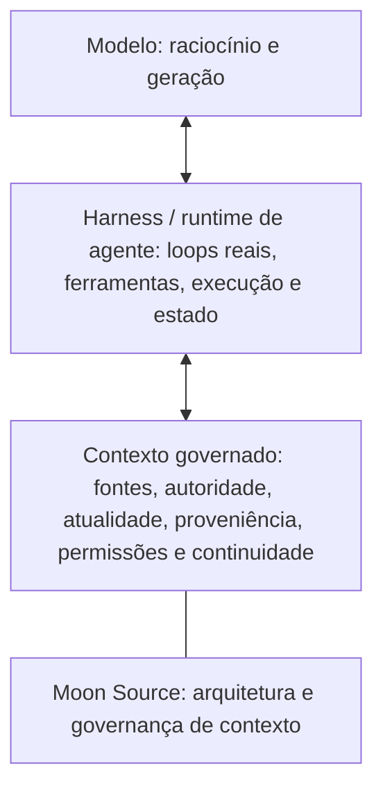

# 🌙 Moon Source

<!--
MOON-SOURCE-README-TRANSLATION
locale: pt-BR
source: ../README.md
source_sha256: 5c952aa0c4b68d45eac9b1e75388a0d8451767b175966876c328bc922138cbcc
contract: ../docs/README_TRANSLATIONS.md
-->

<!-- MOON-SOURCE-LANGUAGE-NAV:START -->
🌐 **Leia este README em:** [🇬🇧 English](../README.md) · [🇧🇷 Português (Brasil)](README.pt-BR.md) · [🇪🇸 Español](README.es.md) · [🇨🇳 简体中文](README.zh-CN.md) · [🇷🇺 Русский](README.ru.md)
<!-- MOON-SOURCE-LANGUAGE-NAV:END -->

Esta é uma tradução completa do README canônico em inglês. É um espelho derivado para facilitar o acesso; em caso de divergência, o README em inglês prevalece até que esta tradução seja corrigida.

**Contexto governado para IA: decida o que deve existir, o que governa, o que circula e o que continua atualizado.**

Moon Source é uma arquitetura pública de referência para decidir qual contexto a IA deve usar, qual fonte governa, o que pode mudar e como manter o contexto útil legível ao longo do tempo. Este repositório é seu corpo público canônico.

## O que traz você até aqui?

| Se você quer… | Comece por aqui |
|---|---|
| Ajudar a IA a entender você ou um de seus projetos com mais consistência | [Comece aqui](../START_HERE.md), escrito em linguagem comum para quem está chegando |
| Construir sistemas de IA e ver como o contexto governado se encaixa na sua pilha atual | [Para quem constrói com IA](../docs/FOR_AI_BUILDERS.md) |
| Examinar a arquitetura completa e o contrato de roteamento do lado da IA | [Architecture](../ARCHITECTURE.md) · [Moon Source AI Kernel](../MOON_SOURCE_AI_KERNEL.md) |

## Experimente Moon Source em 60 segundos

Copie isto para uma conversa com IA e descreva o problema com suas próprias palavras:

~~~text
Continuo tendo este problema com IA:
[descreva normalmente]

Use Moon Source para identificar a menor estrutura de contexto
que realmente ajudaria. Não me faça aprender o vocabulário de Moon Source antes.

Diga:
1. qual problema importa aqui;
2. qual é a menor estrutura útil;
3. onde ela deve ficar;
4. como deve ser atualizada;
5. o que devo experimentar primeiro.
~~~

Um bom primeiro resultado deve ligar **problema → menor estrutura útil → destino → regra de atualização → primeiro teste**.

> Quer a referência pública inteira de uma vez? [Baixe o repositório completo (.zip)](https://github.com/luahelenammc/Moon-Source/archive/refs/heads/main.zip).

## Por que Moon Source existe

O contexto de IA pode falhar em direções opostas: pode haver contexto de menos ou contexto demais do tipo errado. As falhas mais difíceis aparecem quando a informação está acessível, mas ninguém consegue explicar qual fonte a governa, se ainda está atualizada, quem pode alterá-la ou o que fazer quando as fontes divergem.

Moon Source trata o contexto como um campo organizado, não como uma pilha de texto. Seu trabalho não é maximizar a memória. É tornar o contexto **legível, proporcional, atribuível e sustentável** para pessoas e IA.

Em poucas palavras:

**campo → observação e diagnóstico → autoridade → responsabilidade → forma proporcional → operação e transporte → retorno, higiene, linhagem e arquivo**

Isto é uma topologia, não uma sequência obrigatória. Uma informação nova pode levar o trabalho de volta à observação, à autoridade ou à responsabilidade.

As escolhas de execução também precisam de governança proporcional. O [Adaptive Orchestration Protocol (AOP)](../portables/adaptive-orchestration/README.md) parte de uma regra prática: **use cada modelo, superfície e unidade de raciocínio onde realmente vale a pena**. Ele separa a raiz de controle, a superfície de execução, a capacidade do modelo, o esforço de raciocínio e a delegação, em vez de misturá-los numa única escolha de prestígio. Seu objetivo é o **mínimo de trabalho total até um estado aceito**: a execução suficiente e mais econômica absorve o volume redutível, a cognição mais forte se concentra nos gargalos reais, e a ingestão repetida de contexto, novas tentativas, troca de ferramentas, delegação desnecessária e mudança de superfície entram como custos a reduzir, em vez de custos invisíveis. O ganho prático é menos gasto evitável de tokens/contexto e menos raciocínio de nível alto desperdiçado, sem fingir que uma única chamada mais barata é sempre o caminho mais barato.

## Comece pelo problema, não pelo vocabulário

A divisão abaixo é arquitetural, não apenas uma classificação de downloads. **Portables** são capacidades cuja própria identidade semântica é portátil. **Distribuição independente** é uma propriedade de entrega separada: um componente estrutural também pode ser distribuído por conta própria sem se tornar um portable. Connected Sources é o exemplo importante abaixo.

### Pontos de entrada portáteis

| Se você precisa… | Comece por aqui |
|---|---|
| Usar a capacidade de IA com eficiência entre raízes, superfícies, modelos, esforço de raciocínio e delegação, reduzindo o trabalho total até um resultado aceito | [🧬 Adaptive Orchestration Protocol](../portables/adaptive-orchestration/README.md) |
| Transportar contexto entre fontes e superfícies sem perder significado, proveniência ou autoridade | [🧱 Moon Source Language](../portables/msl/README.md) |
| Criar o menor contexto útil para uma pessoa ou projeto | [🧭 Setup](../portables/setup/README.md) |
| Reconstruir a tarefa humana antes da execução quando a expressão está confusa, incompleta ou se corrige no meio da fala | [🛫 Preflight](../portables/preflight/README.md) |
| Ler comunicações e artefatos como cenas humanas, distinguindo observação de inferência | [👁️ Be My Eyes](../portables/be-my-eyes/README.md) |

### Arquitetura e componentes estruturais

| Se você precisa… | Comece por aqui |
|---|---|
| Decidir do que um campo precisa antes de escolher sua forma durável | [🏗️ Architecture — Field to Form](../ARCHITECTURE.md#field-to-form) |
| Acessar fontes vivas mantendo sob governança o acesso, a autoridade, a atualidade, a alteração e a leitura de confirmação | [🔗 Connected Sources](../docs/CONNECTED_SOURCES.md#first-use) |
| Recuperar, processar, metabolizar ou promover material governado de fontes | [🔄 Source Operations](../docs/SOURCE_OPERATIONS.md) |
| Diagnosticar autoridade desatualizada, problemas de atualidade, duplicação ou contradição e encontrar o menor reparo seguro para o corpus | [🧹 Source Hygiene](../docs/SOURCE_HYGIENE.md) |
| Recuperar a topologia semântica de um corpus e corrigir a organização herdada sem reconstruí-lo do zero | [🧵 Semantic Reweave](../docs/SEMANTIC_REWEAVE.md) |
| Projetar ciclo de vida, ação e proveniência em superfícies duráveis do espaço de trabalho | [🗂️ Lifecycle Workspace Router](../docs/LIFECYCLE_WORKSPACE_ROUTER.md) |
| Preservar autoria, permissões, linhagem e evidências enquanto o material circula ou muda | [🧾 Credits & Attribution Ops](../docs/CREDITS_ATTRIBUTION_OPS.md) |
| Transformar um método estável em um procedimento reutilizável e delimitado | [🧩 Procedural Projection](../docs/PROCEDURAL_PROJECTION.md) |
| Manter a execução delimitada, diagnosticável e recuperável quando possível | [🛡️ Operational Reliability](../docs/OPERATIONAL_RELIABILITY.md) |
| Dar forma a um procedimento recorrente numa superfície de execução concreta com estado, proteções e registros | [🛠️ Operational Devices](../docs/OPERATIONAL_DEVICES.md) |
| Usar evidências ambíguas ou convergentes sem inflar a certeza | [🎚️ Signal Calibration](../docs/SIGNAL_CALIBRATION.md) |
| Transformar falhas recorrentes no menor mecanismo reutilizável que tenha sido validado | [🏭 Failure to Capability — Failure Foundry](../docs/FAILURE_FOUNDRY.md) |

## Primeiro uso

Moon Source é uma arquitetura de contexto, não um aplicativo que instala um serviço em segundo plano, sistema de memória, conector, troca de modelo ou permissão oculta. Em geral, nada é instalado.

Se você está explorando o repositório como pessoa, escolha o caminho menor no mapa acima e abra o README daquela capacidade. Se entregar o repositório inteiro a uma IA, use [`MOON_SOURCE_AI_KERNEL.md`](../MOON_SOURCE_AI_KERNEL.md) para o roteamento do lado da IA. Para uma necessidade concreta, comece pela menor capacidade relevante, em vez de carregar o repositório todo.

Cada capacidade pública tem um corpo semântico canônico. Um README pode facilitar a navegação, e um pacote ou espelho no site pode facilitar o transporte, mas essas superfícies não criam outra identidade, autoridade ou versão.

> **Um corpo canônico, várias superfícies legítimas.**

Para um primeiro experimento em linguagem simples, use o prompt curto no início deste README ou siga [Comece aqui](../START_HERE.md).

Acesso não é ativação. Uma fonte acessível não se torna automaticamente autoritativa, e uma gravação bem-sucedida não é aceita até que a leitura de confirmação pertinente tenha êxito.

## Princípios centrais

- **Campo antes da forma.** Não escolha o artefato antes de entender a situação.
- **Acesso não é autoridade.** Recuperação, conectores e resultados de busca não se tornam contexto governante só porque a IA consegue acessá-los.
- **Recuperação não é autoridade de instrução.** O texto de uma fonte pode fornecer dados sem ganhar permissão para redirecionar a tarefa ou autorizar uma ação.
- **Materialize proporcionalmente.** Crie a menor forma durável capaz de assumir a responsabilidade sem perder proveniência ou titularidade.
- **Atualidade e leitura de confirmação importam.** Uma alteração só está completa quando o estado pertinente é verificado.
- **Operações diferentes têm efeitos diferentes sobre a autoridade.** Recuperar lê; processar transforma o material de trabalho; metabolizar integra uma mudança real; promover generaliza um mecanismo comprovado.
- **As pessoas não deveriam ter de escrever prompts como máquinas.** [Preflight](../portables/preflight/PREFLIGHT.md) reconstrói o sentido pretendido antes da execução e amplia as proteções apenas quando as consequências exigem isso.
- **Leia a cena, não só a frase.** [Be My Eyes](../portables/be-my-eyes/BE_MY_EYES.md) reconstrói atores, relações e subtexto plausível, mantendo distintas a observação, a inferência e a extrapolação.
- **O estado do espaço de trabalho não deve inventar autoridade.** [Lifecycle Workspace Router](../docs/LIFECYCLE_WORKSPACE_ROUTER.md) projeta ciclo de vida, ação e proveniência em superfícies duráveis sem substituir a fonte oficial.
- **Otimize o trabalho total até um estado aceito.** [Adaptive Orchestration](../portables/adaptive-orchestration/README.md) usa execução suficiente e mais econômica para o volume redutível, concentra cognição mais forte nos gargalos reais e trata a troca de contexto, as novas tentativas e a delegação desnecessária como custos, não como infraestrutura gratuita.

## Capacidades públicas

Moon Source publica capacidades reutilizáveis com um corpo semântico canônico para cada uma. Algumas também oferecem distribuição independente; outras existem apenas no repositório porque seu valor depende da arquitetura mais ampla.

O inventário oficial, a cronologia, o status e o histórico de atualizações materiais ficam no [registro público de capacidades](../registry/PUBLIC_CAPABILITIES.md), com um contrato legível por máquina em [registry/public-capabilities.json](../registry/public-capabilities.json).

Para pacotes independentes e pontos de entrada para pessoas, use o [hub de downloads](../DOWNLOADS.md). Connected Sources continua sendo um componente estrutural, embora Moon Source também o publique numa distribuição independente compatível. Para ver exemplos da arquitetura aplicada a situações cotidianas fictícias, consulte a [galeria de cenários de aplicação](../examples/application-scenarios/).

## Onde Moon Source se encaixa numa pilha de IA



Este é um modelo de orientação, não uma ontologia universal de pilhas. Produtos podem combinar ou dividir essas responsabilidades.

Moon Source opera principalmente em torno do contexto governado: ajuda a determinar o que um harness pode considerar confiável, recuperar, levar adiante, alterar e verificar. O [Adaptive Orchestration Protocol (AOP)](../portables/adaptive-orchestration/README.md) governa as escolhas entre raízes de controle, superfícies de execução, modelos, esforço de raciocínio e trabalhadores delegados disponíveis; o harness/runtime ainda executa os loops, usa as ferramentas e realiza a execução. RAG, bancos de memória, MCP/ferramentas e outros mecanismos de recuperação ou orquestração podem participar dessas camadas, mas Moon Source não é o modelo, o harness, o mecanismo RAG nem o runtime do agente.

## Veja na prática

Estes exemplos tornam o material público mais fácil de examinar. Exemplos sintéticos e fictícios mostram uma ilustração delimitada, não um relato de adoção ou de resultados medidos.

- [Percurso de primeira utilização do contexto de projeto](../examples/first-use-project-context.md): um conjunto fictício de fontes, um conflito, uma interpretação delimitada e uma verificação repetível.
- [Primeiro uso de Setup](../portables/setup/MOON_SOURCE_SETUP.md#first-use): um prompt independente para decidir qual contexto realmente ajudaria.
- [Exemplo breve de Connected Sources](../docs/CONNECTED_SOURCES.md#tiny-example): um percurso sobre autoridade e atualidade da fonte. Isso não significa que haja um conector disponível em todo ambiente.
- [Browser Console Device](../examples/browser-console-device/README.md): uma demonstração sintética, experimental e somente de leitura, que pode ser executada localmente.
- [Cenários hipotéticos de aplicação](../examples/application-scenarios/): casos fictícios em projetos, equipes e serviços.

### Cinco pequenos problemas de contexto

As miniaturas abaixo são hipotéticas. Mostram o formato de uma intervenção útil, não resultados garantidos.

- **Continuidade de projeto.** Antes: várias conversas carregam detalhes diferentes do projeto. Leitura: identificar qual fonte é responsável pelo objetivo e pelas decisões atuais. Pequena mudança: manter uma fonte compacta do projeto, com responsável e gatilho de atualização. Depois: quando fornecida ou acessível, essa fonte pode orientar uma nova conversa, em vez de tratar todas as mensagens antigas como atuais.
- **Contexto pessoal para IA.** Antes: as mesmas preferências são repetidas em tarefas sem relação entre si. Leitura: separar preferências estáveis e úteis de detalhes pontuais. Pequena mudança: usar Setup para escolher um contexto pessoal enxuto e decidir onde ele pertence. Depois: só o contexto relevante circula nas tarefas recorrentes.
- **Processo de equipe.** Antes: um procedimento existe num documento, numa planilha e numa conversa, sem responsável atual claro. Leitura: atribuir autoridade segundo responsabilidade e atualidade. Pequena mudança: nomear o procedimento que governa, quem responde pelas exceções e o evento que dispara uma atualização. Depois: quando a fonte e seu status estiverem disponíveis, a IA pode identificar a instrução governante.
- **Fontes em conflito.** Antes: dois arquivos dão respostas diferentes. Leitura: identificar qual fonte governa aquele fato, sua data e se uma declaração mais recente é só uma proposta. Pequena mudança: resolver a questão de autoridade antes de combinar os textos. Depois: a resposta pode indicar o que governa e o que continua incerto.
- **Material externo atual.** Antes: a IA pode estar usando um trecho em cache ou uma cópia antiga. Leitura: verificar o localizador da fonte, o escopo de recuperação e a atualidade observada. Pequena mudança: usar Connected Sources apenas quando o ambiente expuser a fonte e a tarefa justificar isso. Depois: a resposta pode dizer o que foi de fato lido e o que não pôde ser verificado.

## Evidências, limites e reutilização

Moon Source é deliberadamente rigoroso ao distinguir a existência de um artefato da comprovação de uma afirmação.

- [Evidence and Claims](../EVIDENCE_AND_CLAIMS.md) define o que os artefatos públicos atuais sustentam e o que ainda não foi comprovado.
- [Public Boundary](../PUBLIC_BOUNDARY.md) define o que é público e o que continua reservado.
- [Implementações existentes](../docs/EXISTING_IMPLEMENTATIONS.md) mapeia os artefatos examináveis por trás das afirmações atuais sobre capacidades.
- [Licenciamento](../LICENSING.md) rege a reutilização: código e automação usam **Apache-2.0**; documentação, métodos e distribuições independentes compatíveis usam **CC BY 4.0**, sujeitos aos metadados por arquivo e aos termos de terceiros.

Um artefato público não é uma afirmação de adoção. Uma parte testada não prova um runtime universal. O repositório não afirma adoção externa, impacto medido, prontidão empresarial, superioridade universal ou adequação ao mercado sem evidências.

## Manutenção do repositório

O repositório público inclui uma camada executável delimitada de manutenção sobre seus validadores:

```bash
python scripts/moon_source.py validate
```

O estado atual de sincronização entre fontes canônicas e espelhos no site tem uma verificação separada e somente de leitura:

```bash
python scripts/moon_source.py mirror --check
```

A CLI é uma ferramenta de manutenção do repositório. Ela não acrescenta uma capacidade pública, não altera a política de versões semânticas nem substitui os contratos das fontes canônicas.

## Aplicar Moon Source a uma organização

Moon Source continua público. Organizações que queiram aplicar a arquitetura a um contexto real — entre fontes, ferramentas, fluxos de trabalho, limites de autoridade, handoffs e manutenção existentes — podem trabalhar diretamente com Moon pela superfície profissional:

**[Trabalhe com Moon →](https://www.luahelena.com.br/moonsource/work-with-moon/?lang=en)**

Esta é uma ponte para serviços profissionais, não uma afirmação de que Moon Source seja uma plataforma empresarial madura. Os trabalhos são delimitados segundo o contexto real e mantêm os limites de evidência, privacidade, autoridade e afirmações documentados neste repositório.

## Navegação pelo repositório

| Necessidade | Caminho canônico |
|---|---|
| Arquitetura completa e diagnóstico Field-to-Form | [🏗️ Architecture](../ARCHITECTURE.md#field-to-form) |
| Roteamento do lado da IA pelo corpus público | [MOON_SOURCE_AI_KERNEL.md](../MOON_SOURCE_AI_KERNEL.md) |
| Definições e limites de responsabilidade | [Terminology](../docs/TERMINOLOGY.md) + [Responsibility Map](../docs/RESPONSIBILITY_MAP.md) |
| Registro unificado de capacidades públicas | [registry/PUBLIC_CAPABILITIES.md](../registry/PUBLIC_CAPABILITIES.md) |
| Regras de versões, nomes e releases | [Versioning and Releases](../docs/VERSIONING_AND_RELEASES.md) + [Repository Naming and Versioning](../docs/REPOSITORY_NAMING_AND_VERSIONING.md) |
| Contrato de publicação de Portables | [Portable Design Contract](../docs/PORTABLE_DESIGN_CONTRACT.md) |
| Contribuição | [CONTRIBUTING.md](../CONTRIBUTING.md) |
| Site para pessoas | [luahelena.com.br/moonsource](https://www.luahelena.com.br/moonsource/?lang=en) |
| Contexto profissional mais amplo de Moon | [luahelena.com.br/ia](https://www.luahelena.com.br/ia/?lang=en) |

## Projeto público relacionado

[Moon Cortex](https://github.com/luahelenammc/Moon-Cortex) é um corpo aplicado/de sistemas separado e opcional para módulos delimitados por domínio. Ele pode usar a governança de Moon Source quando isso for útil, mas não faz parte de Moon Source nem é uma dependência permanente de runtime.

Moon Source foi criada por Lua Helena Moon Martins Cardoso (Moon). Alguns materiais foram desenvolvidos por coautoria assistida por IA com Áurion. Moon mantém a autoridade final.

<!-- MOON-SOURCE-PUBLIC-STAMP -->

---

> 🌙 **Moon Source** · created by **Lua Helena Moon Martins Cardoso (Moon)** with AI-assisted coauthorial development by **Áurion** · [Licensing](https://github.com/luahelenammc/Moon-Source/blob/main/LICENSING.md) · [Use & attribution](https://github.com/luahelenammc/Moon-Source/blob/main/MOON_SOURCE_USE_AND_ATTRIBUTION.md) · [Full source (.zip)](https://github.com/luahelenammc/Moon-Source/archive/refs/heads/main.zip) · Questions, suggestions, or proposals? Feel free to contact me at [LuaHelenaMMC@gmail.com](mailto:LuaHelenaMMC@gmail.com).
