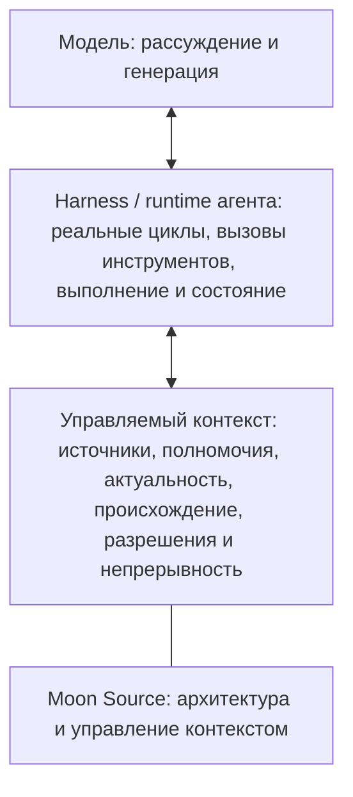

# 🌙 Moon Source

<!--
MOON-SOURCE-README-TRANSLATION
locale: ru
source: ../README.md
source_sha256: 4d7152376f0f4dd8f1d8d22c6c2e1762bdd6435e3d526b8ff7e315da26d087a4
contract: ../docs/README_TRANSLATIONS.md
-->

<!-- MOON-SOURCE-LANGUAGE-NAV:START -->
🌐 **Читайте этот README:** [🇬🇧 English](../README.md) · [🇧🇷 Português (Brasil)](README.pt-BR.md) · [🇪🇸 Español](README.es.md) · [🇨🇳 简体中文](README.zh-CN.md) · [🇷🇺 Русский](README.ru.md)
<!-- MOON-SOURCE-LANGUAGE-NAV:END -->

Это полный перевод канонического README на английском языке. Это производное зеркало для удобства чтения; при расхождении главным остается английский README, пока этот перевод не будет исправлен.

**Управляемый контекст для ИИ: определяйте, что должно существовать, что имеет полномочия, что передается дальше и что должно оставаться актуальным.**

Moon Source — открытая эталонная архитектура, помогающая определить, какой контекст должен использовать ИИ, какой источник имеет полномочия, что можно менять и как сохранять полезный контекст понятным и актуальным. Этот репозиторий — ее канонический публичный корпус.

## Что привело вас сюда?

| Если вы хотите… | Начните отсюда |
|---|---|
| Помочь ИИ лучше и последовательнее понимать вас или один из ваших проектов | [Начните здесь](../START_HERE.md) — материал для новых читателей, написанный обычным языком |
| Создавать системы ИИ и понять, как управляемый контекст вписывается в существующий стек | [Для разработчиков ИИ](../docs/FOR_AI_BUILDERS.md) |
| Изучить полную архитектуру и контракт маршрутизации на стороне ИИ | [Architecture](../ARCHITECTURE.md) · [Moon Source AI Kernel](../MOON_SOURCE_AI_KERNEL.md) |

## Попробуйте Moon Source за 60 секунд

Скопируйте этот текст в разговор с ИИ и опишите проблему своими словами:

~~~text
У меня постоянно возникает такая проблема с ИИ:
[опишите ее обычными словами]

Используй Moon Source, чтобы определить минимальную структуру контекста,
которая действительно поможет. Не заставляй меня сначала изучать терминологию Moon Source.

Расскажи:
1. какая проблема здесь важна;
2. какая структура будет минимально достаточной;
3. где она должна храниться;
4. как ее нужно обновлять;
5. что мне попробовать в первую очередь.
~~~

Полезный первый результат должен связать **проблему → минимально полезную структуру → место хранения → правило обновления → первую проверку**.

> Нужен весь открытый справочный материал? [Скачайте полный репозиторий (.zip)](https://github.com/luahelenammc/Moon-Source/archive/refs/heads/main.zip).

## Зачем нужен Moon Source

Контекст ИИ может быть недостаточным или, наоборот, избыточным и неподходящим. Сложнее всего проблемы возникают, когда информация доступна, но никто не может объяснить, какой источник является определяющим, актуальна ли информация, кто вправе ее изменять и что делать, если источники расходятся.

Moon Source рассматривает контекст как организованное поле, а не как груду текста. Его задача — не максимизировать память, а сделать контекст **понятным, соразмерным, атрибутируемым и поддерживаемым** для людей и ИИ.

Кратко:

**поле → наблюдение и диагностика → полномочия → ответственность → соразмерная форма → операции и передача → обратная связь, гигиена, происхождение и архив**

Это топология, а не обязательный линейный процесс. Новая информация может вернуть работу к наблюдению, определению полномочий или ответственности.

Выбор способов выполнения тоже требует соразмерного управления. [Adaptive Orchestration Protocol (AOP)](../portables/adaptive-orchestration/README.md) исходит из практического правила: **используйте каждую модель, поверхность и единицу рассуждения там, где это действительно оправдано**. Протокол разделяет корень управления, поверхность выполнения, возможности модели, усилие рассуждения и делегирование, вместо того чтобы сводить их к одному престижному выбору. Его цель — **минимум совокупной работы до принятого результата**: достаточно эффективное исполнение берет на себя сокращаемый объем, более сильное мышление сосредоточено на реальных узких местах, а повторное чтение контекста, повторы, смена инструментов, ненужное разветвление и переходы между поверхностями рассматриваются как затраты, которые следует сокращать, а не как незаметные накладные расходы. Практическая польза — меньше предотвратимых расходов на токены/контекст и меньше напрасно затраченного высокоуровневого рассуждения, без утверждения, что один самый дешевый вызов всегда означает самый дешевый путь.

## Начинайте с проблемы, а не с терминологии

Разделение ниже отражает архитектуру, а не только категории загрузки. **Portables** — это возможности, семантическая идентичность которых переносима сама по себе. **Автономное распространение** — отдельное свойство доставки: структурный компонент также можно распространять отдельно, не превращая его в portable. Важный пример ниже — Connected Sources.

### Переносимые точки входа

| Если вам нужно… | Начните отсюда |
|---|---|
| Эффективно использовать возможности ИИ между корнями, поверхностями, моделями, усилием рассуждения и делегированием, сокращая совокупную работу до принятого результата | [🧬 Adaptive Orchestration Protocol](../portables/adaptive-orchestration/README.md) |
| Передавать контекст между источниками и поверхностями, не теряя смысл, происхождение и полномочия | [🧱 Moon Source Language](../portables/msl/README.md) |
| Создать минимально полезный контекст для человека или проекта | [🧭 Setup](../portables/setup/README.md) |
| Восстановить суть человеческой задачи до начала выполнения, если формулировка сбивчивая, неполная или самокорректирующаяся | [🛫 Preflight](../portables/preflight/README.md) |
| Читать сообщения и материалы как человеческие ситуации, различая наблюдение и вывод | [👁️ Be My Eyes](../portables/be-my-eyes/README.md) |

### Структурная архитектура и компоненты

| Если вам нужно… | Начните отсюда |
|---|---|
| Понять, что требуется полю, прежде чем выбирать долговечную форму | [🏗️ Architecture — Field to Form](../ARCHITECTURE.md#field-to-form) |
| Работать с изменяющимися источниками и управлять доступом, полномочиями, актуальностью, изменениями и контрольным чтением | [🔗 Connected Sources](../docs/CONNECTED_SOURCES.md#first-use) |
| Получать, обрабатывать, усваивать или продвигать материалы из управляемых источников | [🔄 Source Operations](../docs/SOURCE_OPERATIONS.md) |
| Выявлять устаревшие полномочия, проблемы актуальности, дублирование и противоречия, находя минимальный безопасный способ исправить корпус | [🧹 Source Hygiene](../docs/SOURCE_HYGIENE.md) |
| Восстанавливать семантическую топологию корпуса и исправлять унаследованную организацию, не перестраивая все с нуля | [🧵 Semantic Reweave](../docs/SEMANTIC_REWEAVE.md) |
| Проецировать жизненный цикл, действия и происхождение на постоянные поверхности рабочей среды | [🗂️ Lifecycle Workspace Router](../docs/LIFECYCLE_WORKSPACE_ROUTER.md) |
| Сохранять авторство, разрешения, происхождение и доказательства при перемещении или изменении материалов | [🧾 Credits & Attribution Ops](../docs/CREDITS_ATTRIBUTION_OPS.md) |
| Превращать стабильный метод в ограниченную и повторно используемую процедуру | [🧩 Procedural Projection](../docs/PROCEDURAL_PROJECTION.md) |
| По возможности делать выполнение ограниченным, диагностируемым и восстановимым | [🛡️ Operational Reliability](../docs/OPERATIONAL_RELIABILITY.md) |
| Оформить повторяющуюся процедуру на конкретной поверхности выполнения с состоянием, ограничителями и квитанциями | [🛠️ Operational Devices](../docs/OPERATIONAL_DEVICES.md) |
| Использовать неоднозначные или взаимно подтверждающие свидетельства, не преувеличивая уверенность | [🎚️ Signal Calibration](../docs/SIGNAL_CALIBRATION.md) |
| Превращать повторяющиеся сбои в минимальный проверенный механизм для повторного использования | [🏭 Failure to Capability — Failure Foundry](../docs/FAILURE_FOUNDRY.md) |

## Первое использование

Moon Source — это архитектура контекста, а не приложение, устанавливающее фоновый сервис, систему памяти, коннектор, переключение модели или скрытое разрешение. Обычно ничего устанавливать не нужно.

Если вы изучаете репозиторий как человек, выберите самый короткий путь на карте выше и откройте README соответствующей возможности. Если вы передаете весь репозиторий ИИ, используйте [`MOON_SOURCE_AI_KERNEL.md`](../MOON_SOURCE_AI_KERNEL.md) для маршрутизации на стороне ИИ. Для конкретной задачи начинайте с самой небольшой релевантной возможности, а не загружайте весь репозиторий.

У каждой публичной возможности есть одно каноническое семантическое описание. README может упростить навигацию, а пакет или веб-зеркало — передачу, но эти поверхности не создают другую идентичность, полномочия или версию.

> **Одно каноническое описание, несколько допустимых поверхностей.**

Для первого простого эксперимента используйте короткий запрос ближе к началу этого README или перейдите в раздел [Начните отсюда](../START_HERE.md).

Доступ не означает активацию. Доступный источник автоматически не становится определяющим, а успешная запись не считается принятой, пока результат не подтвержден соответствующим чтением.

## Основные принципы

- **Поле раньше формы.** Не выбирайте артефакт, пока не поняли ситуацию.
- **Доступ — не полномочия.** Получение данных, коннекторы и результаты поиска не становятся управляющим контекстом только потому, что ИИ может их открыть.
- **Получение данных не дает права отдавать инструкции.** Текст источника может предоставлять данные, но не получает тем самым разрешение перенаправить задачу или санкционировать действие.
- **Материализуйте соразмерно.** Создавайте минимальную долговечную форму, способную нести ответственность без потери происхождения или владельца.
- **Актуальность и контрольное чтение важны.** Изменение завершено только после проверки соответствующего состояния.
- **Разные операции по-разному влияют на полномочия.** Получение данных читает; обработка преобразует рабочий материал; усвоение интегрирует реальное изменение; продвижение обобщает доказанный механизм.
- **Людям не нужно формулировать запросы как машинам.** [Preflight](../portables/preflight/PREFLIGHT.md) восстанавливает предполагаемый смысл до выполнения и усиливает ограничения только тогда, когда этого требуют последствия.
- **Читайте ситуацию, а не только фразу.** [Be My Eyes](../portables/be-my-eyes/BE_MY_EYES.md) восстанавливает участников, отношения и вероятный подтекст, не смешивая наблюдение, вывод и чрезмерную интерпретацию.
- **Состояние рабочей среды не должно придумывать полномочия.** [Lifecycle Workspace Router](../docs/LIFECYCLE_WORKSPACE_ROUTER.md) переносит жизненный цикл, действия и происхождение на постоянные поверхности, не подменяя первичный источник.
- **Сокращайте совокупную работу до принятого результата.** [Adaptive Orchestration](../portables/adaptive-orchestration/README.md) использует достаточное и более экономное исполнение для сокращаемого объема, сосредоточивает более сильное мышление на реальных узких местах и считает смену контекста, повторы и ненужное разветвление затратами, а не бесплатной инфраструктурой.

## Публичные возможности

Moon Source публикует повторно используемые возможности, у каждой из которых есть одно каноническое семантическое описание. Некоторые можно распространять автономно; другие существуют только в репозитории, потому что их ценность зависит от более широкой архитектуры.

Официальный перечень, хронология, статус и история существенных изменений находятся в [публичном реестре возможностей](../registry/PUBLIC_CAPABILITIES.md); машиночитаемый контракт — в [registry/public-capabilities.json](../registry/public-capabilities.json).

Пакеты для автономного распространения и точки входа для людей собраны в [центре загрузок](../DOWNLOADS.md). Connected Sources остается структурным компонентом, хотя Moon Source также выпускает поддерживаемую автономную дистрибуцию. Примеры применения архитектуры к вымышленным бытовым ситуациям находятся в [галерее прикладных сценариев](../examples/application-scenarios/).

## Место Moon Source в стеке ИИ



Это схема для ориентации, а не универсальная онтология стека. Продукты могут объединять эти функции или разделять их.

Moon Source в основном работает вокруг управляемого контекста: помогает определить, чему harness может доверять, что получать, переносить дальше, изменять и проверять. [Adaptive Orchestration Protocol (AOP)](../portables/adaptive-orchestration/README.md) определяет выбор между доступными корнями управления, поверхностями выполнения, моделями, усилием рассуждения и делегированными исполнителями; фактические циклы, вызовы инструментов и выполнение по-прежнему обеспечивает harness/runtime. RAG, хранилища памяти, MCP/инструменты и другие механизмы получения данных или оркестрации могут участвовать в этих слоях, но Moon Source — не модель, не harness, не RAG-механизм и не runtime агента.

## Примеры на практике

Эти примеры упрощают изучение открытых материалов. Синтетические и вымышленные примеры показывают ограниченную иллюстрацию, а не факт внедрения или измеренный результат.

- [Пример первого использования контекста проекта](../examples/first-use-project-context.md): вымышленный набор источников, одно противоречие, ограниченная интерпретация и повторяемая проверка.
- [Первое использование Setup](../portables/setup/MOON_SOURCE_SETUP.md#first-use): автономный запрос, который помогает определить действительно полезный контекст.
- [Краткий пример Connected Sources](../docs/CONNECTED_SOURCES.md#tiny-example): разбор полномочий источника и актуальности. Это не означает, что коннектор доступен в любой среде.
- [Browser Console Device](../examples/browser-console-device/README.md): экспериментальная синтетическая демонстрация только для чтения, которую можно запустить локально.
- [Гипотетические прикладные сценарии](../examples/application-scenarios/): вымышленные случаи для проектов, команд и сервисов.

### Пять небольших проблем с контекстом

Примеры ниже гипотетические. Они показывают форму полезного вмешательства, а не гарантированный результат.

- **Непрерывность проекта.** До: в разных чатах содержатся разные сведения о проекте. Анализ: определить источник, который отвечает за текущую цель и решения. Минимальное изменение: вести один краткий источник по проекту, указав владельца и условие обновления. После: если этот источник предоставлен или доступен, он может направлять новый чат, а не заставлять считать каждое старое сообщение актуальным.
- **Личный контекст ИИ.** До: одни и те же предпочтения приходится повторять в несвязанных задачах. Анализ: отделить стабильные полезные предпочтения от разовых деталей. Минимальное изменение: с помощью Setup выбрать небольшой личный контекст и определить, где он должен храниться. После: в повторяющиеся задачи передается только релевантный контекст.
- **Процесс команды.** До: процедура есть в документе, таблице и чате, но текущий владелец неясен. Анализ: назначить полномочия с учетом ответственности и актуальности. Минимальное изменение: назвать управляющую процедуру, владельца исключений и событие, запускающее обновление. После: если источник и его статус доступны, ИИ может определить управляющее указание.
- **Противоречащие источники.** До: два файла дают разные ответы. Анализ: определить, какой источник управляет данным фактом, какова его дата и является ли более позднее утверждение только предложением. Минимальное изменение: разобраться с полномочиями до объединения текстов. После: в ответе можно указать, что имеет силу и что остается неопределенным.
- **Актуальный внешний материал.** До: ИИ может пользоваться кэшированным фрагментом или старой копией. Анализ: проверить указатель источника, охват получения данных и наблюдаемую актуальность. Минимальное изменение: использовать Connected Sources только тогда, когда среда предоставляет источник и этого требует задача. После: ответ может сообщить, что именно было прочитано и что проверить не удалось.

## Доказательства, границы и повторное использование

Moon Source намеренно строго различает существование артефакта и доказанность утверждения.

- [Evidence and Claims](../EVIDENCE_AND_CLAIMS.md) определяет, что подтверждают текущие публичные артефакты и что пока не доказано.
- [Public Boundary](../PUBLIC_BOUNDARY.md) определяет, что открыто, а что остается зарезервированным.
- [Существующие реализации](../docs/EXISTING_IMPLEMENTATIONS.md) связывает текущие утверждения о возможностях с проверяемыми артефактами.
- [Лицензирование](../LICENSING.md) задает правила повторного использования: код и автоматизация распространяются по **Apache-2.0**, документация, методы и поддерживаемые автономные дистрибутивы — по **CC BY 4.0**, с учетом файловых метаданных и условий третьих сторон.

Публичный артефакт не означает внедрение. Протестированный фрагмент не доказывает универсальность runtime. Без доказательств репозиторий не заявляет о внешнем внедрении, измеренном эффекте, готовности к корпоративному применению, универсальном превосходстве или соответствии продукта рынку.

## Обслуживание репозитория

В открытый репозиторий входит ограниченный исполняемый слой обслуживания поверх валидаторов:

```bash
python scripts/moon_source.py validate
```

Состояние синхронизации между каноническими материалами и веб-зеркалом проверяется отдельно, в режиме только для чтения:

```bash
python scripts/moon_source.py mirror --check
```

CLI — инструмент обслуживания репозитория. Он не добавляет публичную возможность, не меняет правила семантического версионирования и не заменяет контракты канонических источников.

## Применение Moon Source в организации

Moon Source остается открытым. Организации, которые хотят применить архитектуру к реальному контексту — существующим источникам, инструментам, рабочим процессам, границам полномочий, передачам задач и сопровождению, — могут напрямую сотрудничать с Moon через профессиональное направление:

**[Работать с Moon →](https://www.luahelena.com.br/moonsource/work-with-moon/?lang=en)**

Это направление к профессиональным услугам, а не заявление о том, что Moon Source является зрелой корпоративной платформой. Объем работы определяется реальным контекстом с соблюдением ограничений по доказательствам, конфиденциальности, полномочиям и утверждениям, описанных в этом репозитории.

## Недавние изменения возможностей

<!-- MOON-SOURCE-CAPABILITY-DIGEST:START -->
- **2026-09-27 — Connected Sources:** Добавлена доставка контекста с учетом каждого потребителя и возможность выгружать и повторно восстанавливать материалы, влияющие на решения, при сохранении границ полномочий источника; отмечено ограниченное изучение механизмов без копирования кода или runtime.
- **2026-09-27 — Adaptive Orchestration Protocol:** Каноническая идентичность и пути перенесены с Chat–Work Routing Protocol на Adaptive Orchestration Protocol. Версия 6.1 и семантика выполнения не изменились согласно правилу переименования; прежние пути GitHub, пакет и веб-зеркало остались явными маршрутами совместимости. Astra 1.6 и GPT-6 Sol/Luna 1.3 также не изменились.
- **2026-09-24 — Preflight:** Канонический путь, путь пакета и зеркала приведены к стабильной идентичности артефакта; семантическое содержание и версия возможности не изменились.
- **2026-09-24 — Moon Source Setup:** Канонический путь, путь пакета и зеркала приведены к стабильной идентичности артефакта; семантическое содержание и версия возможности не изменились.
- **2026-09-24 — Moon Source Language:** Канонический путь, путь пакета и зеркала приведены к стабильной идентичности артефакта; семантическое содержание и версия возможности не изменились.
<!-- MOON-SOURCE-CAPABILITY-DIGEST:END -->

Эта ограниченная сводка генерируется из единого реестра возможностей. Это не журнал коммитов.

## Навигация по репозиторию

| Потребность | Канонический путь |
|---|---|
| Полная архитектура и диагностика Field-to-Form | [🏗️ Architecture](../ARCHITECTURE.md#field-to-form) |
| Маршрутизация на стороне ИИ по открытому корпусу | [MOON_SOURCE_AI_KERNEL.md](../MOON_SOURCE_AI_KERNEL.md) |
| Определения и границы ответственности | [Terminology](../docs/TERMINOLOGY.md) + [Responsibility Map](../docs/RESPONSIBILITY_MAP.md) |
| Единый реестр публичных возможностей | [registry/PUBLIC_CAPABILITIES.md](../registry/PUBLIC_CAPABILITIES.md) |
| Правила версий, именования и выпусков | [Versioning and Releases](../docs/VERSIONING_AND_RELEASES.md) + [Repository Naming and Versioning](../docs/REPOSITORY_NAMING_AND_VERSIONING.md) |
| Контракт публикации Portables | [Portable Design Contract](../docs/PORTABLE_DESIGN_CONTRACT.md) |
| Участие в проекте | [CONTRIBUTING.md](../CONTRIBUTING.md) |
| Сайт для читателей | [luahelena.com.br/moonsource](https://www.luahelena.com.br/moonsource/?lang=en) |
| Более широкий профессиональный контекст Moon | [luahelena.com.br/ia](https://www.luahelena.com.br/ia/?lang=en) |

## Связанный публичный проект

[Moon Cortex](https://github.com/luahelenammc/Moon-Cortex) — отдельный необязательный прикладной/системный корпус для модулей, ориентированных на предметную область. При необходимости он может использовать правила Moon Source, но не входит в Moon Source и не является постоянной зависимостью runtime.

Moon Source создана Lua Helena Moon Martins Cardoso (Moon). Некоторые материалы созданы в процессе совместной работы Moon и Áurion с помощью ИИ. Окончательное решение остается за Moon.

<!-- MOON-SOURCE-PUBLIC-STAMP -->

---

> 🌙 **Moon Source** · created by **Lua Helena Moon Martins Cardoso (Moon)** with AI-assisted coauthorial development by **Áurion** · [Licensing](https://github.com/luahelenammc/Moon-Source/blob/main/LICENSING.md) · [Use & attribution](https://github.com/luahelenammc/Moon-Source/blob/main/MOON_SOURCE_USE_AND_ATTRIBUTION.md) · [Full source (.zip)](https://github.com/luahelenammc/Moon-Source/archive/refs/heads/main.zip) · Questions, suggestions, or proposals? Feel free to contact me at [LuaHelenaMMC@gmail.com](mailto:LuaHelenaMMC@gmail.com).
