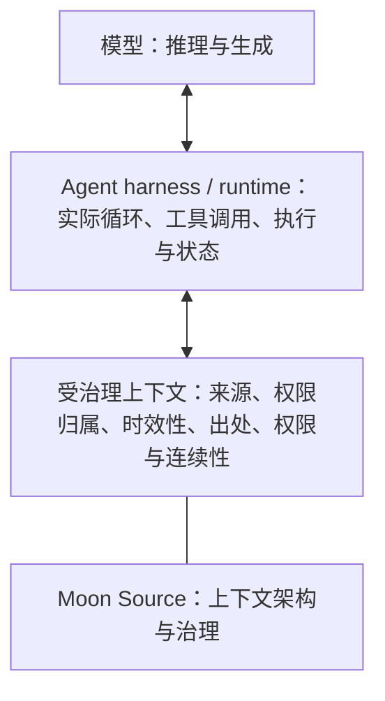

# 🌙 Moon Source

<!--
MOON-SOURCE-README-TRANSLATION
locale: zh-CN
source: ../README.md
source_sha256: 5c952aa0c4b68d45eac9b1e75388a0d8451767b175966876c328bc922138cbcc
contract: ../docs/README_TRANSLATIONS.md
-->

<!-- MOON-SOURCE-LANGUAGE-NAV:START -->
🌐 **阅读此 README：** [🇬🇧 English](../README.md) · [🇧🇷 Português (Brasil)](README.pt-BR.md) · [🇪🇸 Español](README.es.md) · [🇨🇳 简体中文](README.zh-CN.md) · [🇷🇺 Русский](README.ru.md)
<!-- MOON-SOURCE-LANGUAGE-NAV:END -->

这是英文规范 README 的完整译文，作为衍生镜像方便阅读；如有不一致，在本译文修正前，以英文 README 为准。

**面向 AI 的受治理上下文：决定哪些内容应当存在、由什么负责、哪些内容可以流转，以及如何保持更新。**

Moon Source 是一套公开参考架构，用于决定 AI 应使用哪些上下文、哪个来源具有管辖权、哪些内容可以更改，以及如何让有用的上下文长期保持清晰可读。本仓库是其规范的公开主体。

## 你为什么来到这里？

| 如果你想…… | 从这里开始 |
|---|---|
| 让 AI 更一致地理解你或你的某个项目 | [从这里开始](../START_HERE.md)，面向初次阅读者，以日常语言编写 |
| 构建 AI 系统，并了解受治理上下文如何融入现有技术栈 | [面向 AI 构建者](../docs/FOR_AI_BUILDERS.md) |
| 查看完整架构和面向 AI 的路由契约 | [Architecture](../ARCHITECTURE.md) · [Moon Source AI Kernel](../MOON_SOURCE_AI_KERNEL.md) |

## 60 秒试用 Moon Source

把下面内容复制到 AI 对话中，用自己的话描述问题：

~~~text
我总是在 AI 使用中遇到这个问题：
[用日常语言描述]

请使用 Moon Source，找出真正有帮助的最小上下文结构。
不要让我先学习 Moon Source 的术语。

请告诉我：
1. 这里最重要的问题是什么；
2. 最小的有效结构是什么；
3. 它应存放在哪里；
4. 应如何更新；
5. 我可以先尝试什么。
~~~

一个有用的初步结果应当连接 **问题 → 最小有效结构 → 存放位置 → 更新规则 → 首次测试**。

> 想一次获取完整公开参考资料？[下载完整仓库 (.zip)](https://github.com/luahelenammc/Moon-Source/archive/refs/heads/main.zip)。

## Moon Source 为何存在

AI 上下文可能朝两个相反方向失效：上下文太少，或者错误类型的上下文太多。更难处理的情况是：信息可以访问，但没人能说明哪个来源具有管辖权、内容是否仍然有效、谁可以更改它，或者不同来源相互矛盾时该怎么办。

Moon Source 把上下文视为一个有组织的场域，而不是一堆文本。它的目标不是最大化记忆，而是让上下文对人和 AI **清晰、适度、可归属且易于维护**。

简而言之：

**场域 → 观察与诊断 → 权限归属 → 责任 → 适度形式 → 操作与传递 → 反馈、卫生、谱系与归档**

这是一种拓扑结构，不是强制的瀑布式流程。新信息可能会让工作返回观察、权限归属或责任识别阶段。

执行选择也需要适度的治理。[Adaptive Orchestration Protocol (AOP)](../portables/adaptive-orchestration/README.md) 从一条实用规则出发：**让每个模型、界面和推理单元在真正有价值的地方发挥作用**。它将控制根、执行界面、模型能力、推理力度和委派分开，而不是把它们折叠成一个“更高级”的选择。它追求的是**以最少总工作量达到被接受的状态**：成本更低但足够的执行处理可约简的大量工作；更强的认知能力集中在真正的瓶颈上；重复摄取上下文、重试、工具切换、不必要的扇出和界面切换都被视为需要降低的成本，而非看不见的开销。实际收益是减少可避免的 token/上下文消耗，以及浪费在高阶推理上的资源，但不会假装一次最便宜的调用永远是成本最低的路线。

## 从问题开始，而不是从术语开始

下方的划分体现的是架构角色，而不只是下载分类。**Portables** 是语义身份本身可以独立携带的能力。**独立分发**则是另一种交付属性：结构组件也可以单独分发，但这不会使它成为 portable。下面的 Connected Sources 是一个重要例子。

### 可移植入口

| 如果你需要…… | 从这里开始 |
|---|---|
| 在控制根、界面、模型、推理力度和委派之间有效运用 AI 能力，以尽量少的总工作量获得可接受结果 | [🧬 Adaptive Orchestration Protocol](../portables/adaptive-orchestration/README.md) |
| 在不同来源和界面之间传递上下文，同时保留含义、出处和权限归属 | [🧱 Moon Source Language](../portables/msl/README.md) |
| 为个人或项目构建最小而有用的上下文 | [🧭 Setup](../portables/setup/README.md) |
| 当表达混乱、不完整或不断自我修正时，在执行前重建人的真实任务 | [🛫 Preflight](../portables/preflight/README.md) |
| 把通信和材料视为人的情境，同时区分观察与推断 | [👁️ Be My Eyes](../portables/be-my-eyes/README.md) |

### 结构架构与组件

| 如果你需要…… | 从这里开始 |
|---|---|
| 在选择长期形式之前，先判断一个场域需要什么 | [🏗️ Architecture — Field to Form](../ARCHITECTURE.md#field-to-form) |
| 访问持续变化的来源，同时治理访问权、权限归属、时效性、修改和回读 | [🔗 Connected Sources](../docs/CONNECTED_SOURCES.md#first-use) |
| 检索、处理、吸收或提升受治理的来源材料 | [🔄 Source Operations](../docs/SOURCE_OPERATIONS.md) |
| 诊断过期的权限归属、时效性问题、重复或矛盾，并找出对语料库最小且安全的修复 | [🧹 Source Hygiene](../docs/SOURCE_HYGIENE.md) |
| 恢复语料库的语义拓扑，并修复继承而来的组织方式，而无需从头重建 | [🧵 Semantic Reweave](../docs/SEMANTIC_REWEAVE.md) |
| 把生命周期、行动和出处投射到持久工作区界面上 | [🗂️ Lifecycle Workspace Router](../docs/LIFECYCLE_WORKSPACE_ROUTER.md) |
| 在材料移动或更改时保留作者身份、权限、谱系和证据 | [🧾 Credits & Attribution Ops](../docs/CREDITS_ATTRIBUTION_OPS.md) |
| 将稳定方法转换为有界且可复用的程序 | [🧩 Procedural Projection](../docs/PROCEDURAL_PROJECTION.md) |
| 在可能时让执行保持有界、可诊断和可恢复 | [🛡️ Operational Reliability](../docs/OPERATIONAL_RELIABILITY.md) |
| 在具体执行界面中，通过状态、护栏和收据体现重复性程序 | [🛠️ Operational Devices](../docs/OPERATIONAL_DEVICES.md) |
| 面对含糊或相互印证的证据时，不夸大确定性 | [🎚️ Signal Calibration](../docs/SIGNAL_CALIBRATION.md) |
| 将重复出现的失败转化为最小且经过验证的可复用机制 | [🏭 Failure to Capability — Failure Foundry](../docs/FAILURE_FOUNDRY.md) |

## 首次使用

Moon Source 是一套上下文架构，不是会安装后台服务、记忆系统、连接器、模型切换或隐式权限的应用。通常无需安装任何东西。

如果你以普通读者身份浏览仓库，请从上面的地图中选择最小的路径，再打开相应能力的 README。如果把整个仓库交给 AI，请使用 [`MOON_SOURCE_AI_KERNEL.md`](../MOON_SOURCE_AI_KERNEL.md) 进行面向 AI 的路由。对于一个具体需求，应从相关的最小能力开始，而不是载入整个仓库。

每项公开能力都有一个规范语义正文。README 可以让浏览更方便，软件包或网站镜像可以让传递更方便，但这些界面不会构成另一个身份、权限归属或版本。

> **一个规范正文，多种合理界面。**

若要进行第一次简单尝试，请使用本 README 开头附近的短提示，或前往[从这里开始](../START_HERE.md)。

可访问不等于已启用。一个能够访问的来源不会自动成为权威来源；一次成功写入也必须经过相关回读确认，才能视为完成。

## 核心原则

- **先看场域，再定形式。** 先了解情况，再决定要创建什么材料。
- **访问权不等于权限归属。** AI 能访问检索结果、连接器或搜索结果，不代表它们就成为支配当前工作的上下文。
- **检索不赋予指令权限。** 来源文本可以提供数据，但不会因此获得重定向任务或授权行动的权限。
- **按比例实体化。** 创建能够承担相应责任的最小持久形式，同时保留出处和所有权。
- **时效性和回读很重要。** 只有在相关状态得到验证后，修改才算完成。
- **不同操作对权限的影响不同。** 检索负责读取；处理会转换工作材料；吸收会整合真实变化；提升会推广已证明的机制。
- **人不该被迫像机器那样写提示词。** [Preflight](../portables/preflight/PREFLIGHT.md) 会在执行前重建预期含义，并只在后果需要时加强护栏。
- **读情境，而不只是句子。** [Be My Eyes](../portables/be-my-eyes/BE_MY_EYES.md) 会重建参与者、关系和合理的潜台词，同时区分观察、推断和过度解读。
- **工作区状态不能凭空创造权限。** [Lifecycle Workspace Router](../docs/LIFECYCLE_WORKSPACE_ROUTER.md) 会把生命周期、行动和出处投射到持久界面上，但不会替代记录来源。
- **优化到被接受状态的总工作量。** [Adaptive Orchestration](../portables/adaptive-orchestration/README.md) 会用成本更低但足够的执行处理可约简工作，把更强的认知能力集中在真正的瓶颈上，并把上下文反复变动、重试和不必要的扇出视为成本，而不是免费的管道。

## 公开能力

Moon Source 发布可复用的公开能力，每项能力都有一个规范语义正文。有些能力也支持独立分发；另一些只存在于仓库中，因为它们的价值依赖更大的架构。

权威清单、时间线、状态和重大更新历史位于[公开能力注册表](../registry/PUBLIC_CAPABILITIES.md)，机器可读契约则位于 [registry/public-capabilities.json](../registry/public-capabilities.json)。

对于独立软件包和面向读者的入口，请查看[下载中心](../DOWNLOADS.md)。Connected Sources 仍是结构组件，即使 Moon Source 也将它作为受支持的独立分发版本发布。若要查看架构如何应用于虚构的日常情境，请浏览[应用场景集](../examples/application-scenarios/)。

## Moon Source 在 AI 技术栈中的位置



这是一个定位模型，不是普遍适用的技术栈本体论。产品可能会合并或拆分这些职责。

Moon Source 主要在受治理上下文领域运作：它帮助判断 harness 可以信任、检索、延续、修改和验证哪些内容。[Adaptive Orchestration Protocol (AOP)](../portables/adaptive-orchestration/README.md) 负责在可用的控制根、执行界面、模型、推理力度和受委派工作者之间制定选择；实际循环、工具调用和执行仍由 harness/runtime 完成。RAG、记忆库、MCP/工具以及其他检索或编排机制可以参与这些层，但 Moon Source 不是模型、harness、RAG 引擎或 agent runtime。

## 看看实际例子

这些例子让公开材料更容易检查。合成和虚构示例用于展示有界的说明，不代表采用情况或衡量过的结果。

- [项目上下文首次使用示例](../examples/first-use-project-context.md)：一组虚构来源、一个冲突、有界解释和可重复检查。
- [Setup 首次使用](../portables/setup/MOON_SOURCE_SETUP.md#first-use)：用于判断哪种上下文真正有帮助的独立提示词。
- [Connected Sources 简短示例](../docs/CONNECTED_SOURCES.md#tiny-example)：演示来源权限归属和时效性。这不意味着每个环境都提供连接器。
- [Browser Console Device](../examples/browser-console-device/README.md)：一个实验性的、只读的合成演示，可在本地运行。
- [假设性应用场景](../examples/application-scenarios/)：涵盖项目、团队和服务的虚构案例。

### 五个小型上下文问题

以下小例子均为假设。它们展示有效干预的形态，不保证结果。

- **项目连续性。** 之前：几段对话记载了不同的项目细节。分析：找出哪个来源负责当前目标和决策。最小调整：维护一份简短的项目上下文，标明负责人和更新触发条件。之后：当该来源已提供或可访问时，它可以指导新对话，而不是让每条旧消息都看起来仍然有效。
- **个人 AI 上下文。** 之前：同样的偏好在无关任务中反复说明。分析：区分稳定且有用的偏好与一次性细节。最小调整：用 Setup 选择精简的个人上下文，并决定它应存放在哪里。之后：只有相关上下文会流入重复性任务。
- **团队流程。** 之前：一个流程同时存在于文档、电子表格和聊天中，没有明确的当前负责人。分析：按责任和时效性确定权限归属。最小调整：指定起支配作用的流程、例外事项负责人，以及触发更新的事件。之后：当来源及其状态可用时，AI 可以识别起支配作用的指令。
- **来源冲突。** 之前：两个文件给出不同答案。分析：查明哪个来源对该事实具有管辖权、它的日期，以及较新的说法是否只是提议。最小调整：先解决权限归属问题，再合并文本。之后，回答可以说明什么内容起支配作用、哪些部分仍不确定。
- **当前外部材料。** 之前：AI 可能使用缓存片段或旧副本。分析：检查来源定位符、检索范围和观察到的时效性。最小调整：只有当环境提供该来源且任务确有需要时，才使用 Connected Sources。之后，回答可以说明实际读取了什么、哪些内容无法核实。

## 证据、边界与复用

Moon Source 严格区分材料存在与某项主张已被证明。

- [Evidence and Claims](../EVIDENCE_AND_CLAIMS.md) 说明当前公开材料可以支持哪些内容，以及哪些内容尚未得到证明。
- [Public Boundary](../PUBLIC_BOUNDARY.md) 规定哪些内容公开，哪些仍保留在公开边界之外。
- [现有实现](../docs/EXISTING_IMPLEMENTATIONS.md) 列出支撑当前能力主张的可检查材料。
- [许可](../LICENSING.md) 规定复用方式：代码和自动化采用 **Apache-2.0**；文档、方法和受支持的独立分发材料采用 **CC BY 4.0**，并受文件级元数据和第三方条款约束。

公开材料不等于采用声明。经过测试的一部分也不能证明某个 runtime 普遍适用。没有证据时，仓库不声称存在外部采用、可测量影响、企业级成熟度、普遍优越性或产品市场契合度。

## 仓库维护

公开仓库包含一个围绕现有验证器的有界可执行维护层：

```bash
python scripts/moon_source.py validate
```

当前规范正文与网站镜像之间的状态有一项独立的只读检查：

```bash
python scripts/moon_source.py mirror --check
```

CLI 是仓库维护工具。它不会新增公开能力、改变语义版本策略或取代规范来源契约。

## 将 Moon Source 应用于组织

Moon Source 本身仍然是公开的。希望把这套架构应用于真实上下文的组织——涉及现有来源、工具、工作流、权限边界、交接和维护——可以通过专业应用服务直接与 Moon 合作：

**[与 Moon 合作 →](https://www.luahelena.com.br/moonsource/work-with-moon/?lang=en)**

这是通往专业服务的桥梁，不代表 Moon Source 已成为成熟的企业平台。合作范围会根据实际情境确定，并遵守本仓库记录的证据、隐私、权限和主张边界。

## 仓库导航

| 需求 | 规范路径 |
|---|---|
| 完整架构和 Field-to-Form 诊断 | [🏗️ Architecture](../ARCHITECTURE.md#field-to-form) |
| AI 通过公开语料库进行路由 | [MOON_SOURCE_AI_KERNEL.md](../MOON_SOURCE_AI_KERNEL.md) |
| 定义与责任边界 | [Terminology](../docs/TERMINOLOGY.md) + [Responsibility Map](../docs/RESPONSIBILITY_MAP.md) |
| 统一的公开能力注册表 | [registry/PUBLIC_CAPABILITIES.md](../registry/PUBLIC_CAPABILITIES.md) |
| 版本、命名与发布规则 | [Versioning and Releases](../docs/VERSIONING_AND_RELEASES.md) + [Repository Naming and Versioning](../docs/REPOSITORY_NAMING_AND_VERSIONING.md) |
| Portables 发布契约 | [Portable Design Contract](../docs/PORTABLE_DESIGN_CONTRACT.md) |
| 参与贡献 | [CONTRIBUTING.md](../CONTRIBUTING.md) |
| 面向读者的网站 | [luahelena.com.br/moonsource](https://www.luahelena.com.br/moonsource/?lang=en) |
| Moon 的更广泛专业背景 | [luahelena.com.br/ia](https://www.luahelena.com.br/ia/?lang=en) |

## 相关公开项目

[Moon Cortex](https://github.com/luahelenammc/Moon-Cortex) 是一个独立且可选的应用/系统内容主体，用于按领域划分的模块。在适用时，它可以采用 Moon Source 的治理方式，但它不属于 Moon Source，也不是长期的 runtime 依赖。

Moon Source 由 Lua Helena Moon Martins Cardoso (Moon) 创建。部分材料由 Moon 与 Áurion 在 AI 协助下共同创作。Moon 保留最终决定权。

<!-- MOON-SOURCE-PUBLIC-STAMP -->

---

> 🌙 **Moon Source** · created by **Lua Helena Moon Martins Cardoso (Moon)** with AI-assisted coauthorial development by **Áurion** · [Licensing](https://github.com/luahelenammc/Moon-Source/blob/main/LICENSING.md) · [Use & attribution](https://github.com/luahelenammc/Moon-Source/blob/main/MOON_SOURCE_USE_AND_ATTRIBUTION.md) · [Full source (.zip)](https://github.com/luahelenammc/Moon-Source/archive/refs/heads/main.zip) · Questions, suggestions, or proposals? Feel free to contact me at [LuaHelenaMMC@gmail.com](mailto:LuaHelenaMMC@gmail.com).
